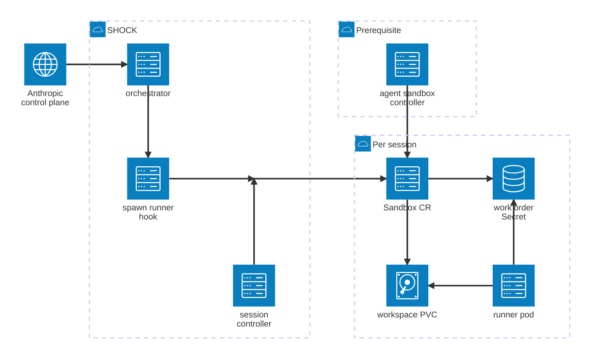
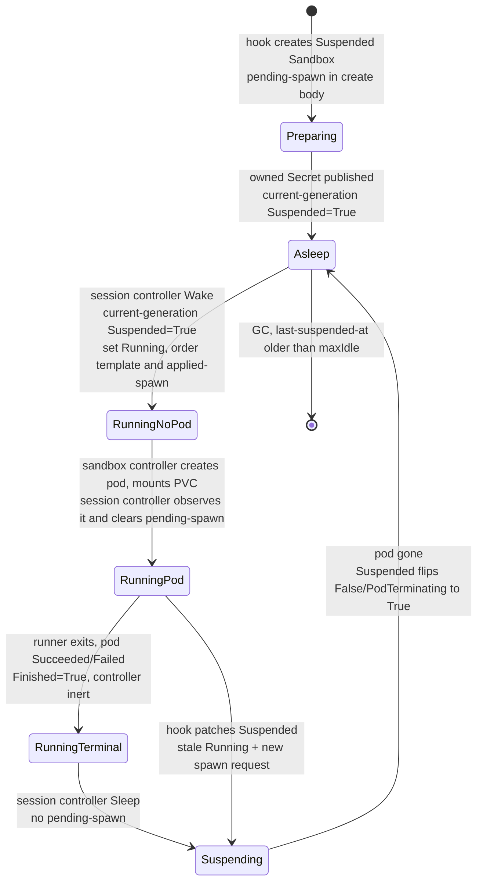

# SHOCK — Self-Hosted Orchestrator for Claude on Kubernetes

Spec: Helm chart + companion controller for suspend/resume Claude Code self-hosted runners.

Status: draft for implementation · License: Apache-2.0 (open source) · Target: in-support upstream Kubernetes (kubeVersion policy in [section 4](#4-deliverable-a--helm-chart))
Implementation agent: Claude Code. Read this whole document before writing code.

## 1. Goal

Package, as one Helm chart plus one small companion controller, an on-demand Claude Code
self-hosted runner environment where **every user session gets a persistent per-session disk
that survives sleep and reattaches on resume**, with scale-to-zero between messages.

The design was validated against Anthropic's docs and the agent-sandbox controller source.
Do not re-litigate the architecture; implement it. Where this spec says "verify", re-check the
live doc/source at implementation time (both products are beta and move quickly).

## 2. Architecture (fixed decisions)

Components, per environment:

1. **Anthropic orchestrator** (`claude self-hosted-runner orchestrator`) — Deployment, 2 replicas.
   Holds the environment secret. Its only extension point is the required `spawn-runner` hook;
   it receives no other lifecycle events.
2. **spawn-runner hook** — `shock hook spawn-runner`, a subcommand of the same Go binary as the
   session controller, reached through `/hooks/spawn-runner` **baked into the image** (a symlink to
   the `shock` binary, which runs the hook when invoked under that name). Nothing is mounted at `/hooks`. Executed by
   the orchestrator once per spawn request. It only *declares* state (create/patch Sandbox, write
   work-order Secret, stamp `pending-spawn` annotation) and exits fast. It never waits for pods.
3. **agent-sandbox controller** (kubernetes-sigs/agent-sandbox, v1beta1 API) — **hard prerequisite,
   never vendored or installed by this chart**; the operator installs it from upstream releases.
   One `Sandbox` per Claude session; PVC per session via `volumeClaimTemplates`.
4. **session-controller** (Go, controller-runtime; same binary and image as the hook, run as its
   own Deployment) — the single sequencer for sleep and wake. Bridges "runner process ended" →
   `operatingMode: Suspended` and "pending-spawn declared + suspension confirmed" →
   `operatingMode: Running`.
5. **Runner pods** — created by the sandbox controller from the Sandbox `podTemplate`; run
   `claude self-hosted-runner --capacity 1` against the per-session work-order JWT, on the
   per-session PVC. `restartPolicy: Never`. No service-account token. No sidecars.



The Sandbox owns the PVC and all of its immutable per-order Secrets. Deleting the Sandbox
cascades to those resources. No SHOCK component talks to another directly: every relation between them passes
through a Kubernetes object, which is what lets the hook write and exit without waiting on the
session controller. The junction is where the hook and the session controller both write the same
Sandbox.

Four relations are omitted, because the notation gives each node only four attachment points and
no edge labels: the hook also creates immutable work-order Secrets, the agent-sandbox controller also
creates and deletes the Pod and creates the PVC, and the runner pod registers and polls the control
plane directly.

### Session lifecycle (normative)

States are the observable combination of `spec.operatingMode`, the Sandbox's conditions, its
SHOCK annotations, and owned Pod existence — not `operatingMode` alone. The two easily-missed
states are `RunningTerminal` (a finished pod that the sandbox controller will not replace) and
`Suspending` (the pod is gone from intent but not yet from the API).



`RunningPod` means that the order has produced a new owned runner Pod and SHOCK has acknowledged
its creation. It does **not** mean that the Pod is Ready or that the Claude runner has registered
with the control plane. A Pod that was created and failed quickly can pass through this state
immediately into `RunningTerminal`. Kubernetes readiness is observational only and never drives a
SHOCK lifecycle transition.

`Suspending` has no edge back to `RunningPod`: the Wake predicate gates on `Suspended` reaching
`True` for the current generation while the spec requests suspension, so a wake cannot fire while the previous pod is still terminating. That is the fail-closed
property the session controller depends on.

**Bounce** — used throughout this document — means driving a session from `Running` through
`Suspended` and back. That round-trip is the only way to replace a pod: the sandbox controller
never replaces one on its own while `operatingMode` stays `Running`, so a session whose pod is
terminal or stale can only be restarted by suspending it first.

The hook never waits for a pod — it writes the work-order Secret and declares intent, then exits;
every transition on the diagram is driven by the session controller or the sandbox controller. The PVC and
the Sandbox object survive every edge except the last, so a resumed session finds its canonical
clone already on disk and does a fetch + hard reset rather than a fresh clone. Hook branches are
specified in [section 6](#6-deliverable-b--spawn-runner-hook); predicates in
[section 7](#7-deliverable-c--session-controller-go).

Facts this relies on (verified against `controllers/sandbox_controller.go` @ main, 2026-08):
the controller never deletes/recreates a terminal pod while `operatingMode: Running`; the
`Suspended` branch deletes the pod regardless of phase (ownership + DeletionTimestamp checks
only); resume recreates the pod from `podTemplate` and re-uses the deterministic PVC
(`<claimTemplate>-<sandboxName>`); `Finished` is present-only-while-applicable; two owned pods
-> `Ready=False/MultiplePods` and the controller refuses to act. Pin the agent-sandbox version
and encode these behaviors as e2e conformance tests ([section 12](#12-testing-and-acceptance-criteria)) so upgrades that break them fail CI.

### Why Sandbox and not Job + PVC (rationale, do not re-litigate)

A plain `Job` per run against a session-named PVC is the obvious alternative and is rejected for
one decisive reason: **the hook must exit fast and never wait for pods** ([section 6.3](#6-deliverable-b--spawn-runner-hook)). Starting a run for
an existing session under Job semantics requires deleting the prior Job and waiting for its pods to
fully terminate before creating the next one — Job specs are immutable, so there is no declarative
"make this run" target to converge on, and that wait cannot be deferred out of the hook. The Sandbox
split is what makes a fast hook possible: the hook *declares* (`pending-spawn`), the session controller
*sequences*. Secondarily, `Suspended=True` is a controller-provided "the old pod is gone" barrier
that a Job design would force the hook to synthesize itself.

### Non-goals (do not implement)

- Mid-session memory hibernation (protocol-impossible: ~60 s poll lease, transcript-replay resume).
- Per-account shared disks, RWX volumes, slot pools (superseded by per-session PVC + session-bound
  work orders).
- KEDA/HPA scaling of runners (the orchestrator is the autoscaler).
- In-pod sidecars or SA tokens for suspend (superseded by the external session controller).
- `shutdownTime`/`shutdownPolicy` on resumable Sandboxes (expiry short-circuits reconciliation
  until the field is cleared; GC is the session controller's job instead).
- **Any node-scoped action.** SHOCK is namespaced: it never taints, drains, cordons, or otherwise
  mutates Nodes, and never force-deletes a Pod. Recovering a stranded session is a cluster-admin
  action; SHOCK's responsibility ends at the alert ([section 7](#7-deliverable-c--session-controller-go) Zombie, [section 11](#11-monitoring)).
- **`spec.autoSuspension`**. Never set it; SHOCK's sleep decision belongs to the session controller.
  See [section 13.7](#13-open-items-to-verify-during-implementation-do-first).

## 3. Repository layout

```
shock/
├── charts/shock/          # the Helm chart (deliverable A)
│   ├── Chart.yaml  values.yaml  values.schema.json
│   ├── templates/  (see [section 4](#4-deliverable-a--helm-chart))
│   └── README.md   (rendered install/upgrade/ops doc)
├── cmd/shock/                      # one binary, two subcommands: `hook spawn-runner`, `session-controller`
├── internal/naming/                # [section 5](#5-naming-and-metadata-conventions-normative) names, labels, annotations — shared by hook and session controller
├── internal/hook/                  # deliverable B
├── internal/sessioncontroller/            # deliverable C
├── images/orchestrator/Dockerfile  # multi-stage: builds cmd/shock, COPYs it beside `claude`,
│                                   # links /hooks/spawn-runner to it; one image serves
│                                   # orchestrator, hook, and session controller
├── test/e2e/                       # kind-based e2e incl. agent-sandbox conformance ([section 12](#12-testing-and-acceptance-criteria))
├── LICENSE  README.md  CONTRIBUTING.md   # OSS hygiene: Apache-2.0, quickstart, dev guide
└── .github/workflows/              # lint (ct), unit, e2e, image build+sign
```

The runner image is **an input with a default**: the chart takes `runner.image` as a value and
defaults it to `images/runner/Dockerfile`, published alongside the orchestrator image and pinned by
digest in the released chart. The default follows the deploy doc's recipe plus user-space package
managers (mise, uv) so sessions install tooling without root; operators build their own image
`FROM` it. Document the contract in the chart README: contains `claude` (pinned version ≥ the beta
minimum), git ≥ 2.32, a non-root user with writable `$HOME` and `/workspace`, and an optional
wrapper at a known path for registry credentials ([section 9](#9-registry-credentials-npm--nuget--docker)).

## 4. Deliverable A — Helm chart

Chart name `shock`, apiVersion v2. **agent-sandbox is a prerequisite, not a dependency**: the
chart never vendors, renders, or owns its CRDs or controller (CRD lifecycle belongs to exactly
one owner; a chart that ships someone else's CRDs breaks that owner's upgrades). Instead: link
to https://github.com/kubernetes-sigs/agent-sandbox for installation and let it own its own
instructions. **No preflight hook Jobs**: the chart
must install cleanly on a cluster where the CRD is absent, so the prerequisite is surfaced at
runtime only — the session controller checks via the discovery API at startup that
`sandboxes.agents.x-k8s.io` serves `v1beta1`, and while it is missing stays alive but not-Ready
with a clear log line and re-checks on an interval (no CrashLoopBackOff); the spawn-runner hook
maps a missing CRD to exit 1 (retryable), so queued sessions back off and recover on their own
once the prerequisite lands. `helm template` and `helm install` must both succeed without the
CRDs present so GitOps engines can converge in any order.

Kubernetes version support is **derived, not invented**: agent-sandbox publishes no compatibility
matrix, so set `Chart.yaml` `kubeVersion` to `>= <M>.<m>-0` where `<M>.<m>` is two minors below
the `k8s.io/*` library version pinned by the lowest tested agent-sandbox release (e.g. libraries at
v0.36.x -> `>=1.34.0-0`), matching upstream's supported-skew window. Re-derive on every
agent-sandbox bump; CI e2e runs against the oldest and newest allowed minors. The controller only
uses GA core APIs, so document in the README that older clusters may work but are untested and
unsupported.

### Templates

| Template | Requirements |
|---|---|
| `orchestrator-deployment.yaml` | 2 replicas (value), `claude self-hosted-runner orchestrator --hooks-dir /hooks --environment-secret-file /secrets/environment-secret --expected-spawn-seconds N --hook-timeout N --hook-concurrency N --health-port 8080`. Env secret from `existingSecret` or chart-managed Secret. **Nothing mounts at `/hooks`** — the hook entry point ships in the image; a mount there would shadow it. The Sandbox template ConfigMap mounts read-only at `/etc/shock`. PDB minAvailable 1. Anti-affinity across nodes. Enforce at template level: `hookTimeout + 5 < expectedSpawnSeconds` (the process enforces it at startup; fail earlier in `helm template` via `fail`). |
| `orchestrator-rbac.yaml` | ServiceAccount + namespaced Role/RoleBinding for the hook: `sandboxes` get/create/patch; `secrets` get/create (ownerReference is included at creation; restrict with a name-prefix convention documented in README; K8s RBAC cannot prefix-match — mitigate by dedicating the runner namespace). |
| `sandbox-template-configmap.yaml` | One key, `sandbox-template.yaml`: the Sandbox manifest **fully rendered by Helm** — values, the `runner.podTemplate` merge, and the [section 5](#5-naming-and-metadata-conventions-normative) label literals all resolved at chart render time. Mounted read-only at `/etc/shock`. The hook unmarshals it into a typed `Sandbox` and fills in only the session-specific identity fields. Helm does value merging; Go does typed apply; neither reimplements the other. |
| `session-controller-deployment.yaml` | 1 replica, `strategy: Recreate` (no leader election — every mutation uses the concurrency preconditions in section 6, including GC, so brief overlap during rescheduling is safe), image = `orchestrator.image`, command `shock session-controller`. `SHOCK_RELEASE` from `.Release.Name` ([section 7](#7-deliverable-c--session-controller-go) selector). Readiness/liveness: controller-runtime's `/readyz` and `/healthz` on the manager's health port; readiness gated on the informer cache having synced and the CRD being served. Requests ≤50m/64Mi. |
| `session-controller-rbac.yaml` | `sandboxes` get/list/watch/patch (+delete for GC); `secrets` get (immutable order verification only — **never** `delete`; all order Secrets are reaped by ownerReference when the Sandbox goes); `pods` get/list/watch (spawn observation and zombie *detection* only — **never** `delete`; see [section 7](#7-deliverable-c--session-controller-go)); `events` create/patch. No leases. |
| `runner-networkpolicy.yaml` | See [section 10](#10-network-policy-cilium-mode). Rendered per `network.mode: cilium|kubernetes|none`. |
| `podmonitor.yaml`, `prometheusrule.yaml` | [section 11](#11-monitoring). Gated by `monitoring.enabled`. |
| `_helpers.tpl` | `shock.fullname`, `shock.labels`, `shock.selectorLabels` ([section 5](#5-naming-and-metadata-conventions-normative)). Every template uses them; no template writes a label literal. |

### values.yaml (sketch — authoritative shape, extend as needed)

```yaml
environment:
  existingSecret: ""            # Secret with key environment-secret; required if secretValue unset
orchestrator:
  image: {repository: "", tag: ""}   # required
  replicas: 2
  expectedSpawnSeconds: 180     # p99 wake incl. session-controller latency + pod start + image pull
  hookTimeout: 30
  hookConcurrency: 4
sessionController:
  resyncSeconds: 300                       # informer resync backstop; reconcile is event-driven
  gc: {enabled: true, maxIdle: 336h}      # delete Sandbox+PVC after 14 d asleep
  zombie: {enabled: true, alertAfter: 5m}  # alarm-only threshold; the session controller never deletes pods
  maxActiveRunners: 0                      # planned (section 7, "Active-runner cap"): 0 = unlimited
runner:
  image: {repository: "", tag: ""}   # required; contract in README
  baseDir: /home/runner/workspace   # --base-dir; at or below storage.mountPath
  runtimeClassName: ""          # e.g. kata / gvisor; empty = runc
  terminationGracePeriodSeconds: 120   # ≥ effective SIGKILL floor (75 s; 105 s with push-outcome)
  flags:
    releaseIdleSessionMin: 30
    killSessionAfterMin: 480
    exitIfUnusedMin: 10
    pushOutcomeOnRelease: true
  storage:
    mountPath: /home/runner       # the PVC is the runner's home; baseDir lives inside it
    className: ""
    size: 20Gi
    accessMode: ReadWriteOncePod   # double-writer guard ([section 7](#7-deliverable-c--session-controller-go)); immutable after creation, see [section 5](#5-naming-and-metadata-conventions-normative)
  extraEnv: []                  # e.g. CLAUDE_ENV_FILE, mirror URLs
  extraVolumes: []              # e.g. registry-credentials Secret for the wrapper ([section 9](#9-registry-credentials-npm--nuget--docker))
  extraVolumeMounts: []
  instructions: |               # rendered into a ConfigMap and mounted read-only at
    # This runner environment    # /etc/claude-code/CLAUDE.md, Claude Code's managed-policy
    ...                          # instructions loaded into every session; "" mounts nothing
  podTemplate: {}               # strategic-merged into the Sandbox podTemplate by Helm;
                                # the hook forces the load-bearing fields afterwards (section 6)
network:
  mode: cilium
  allowedFQDNs:                 # host or host:port; port defaults to 443. One list for every
    - api.anthropic.com         # egress destination: Anthropic, git hosts, package registries.
    - github.com                # Extend per the deploy doc's egress list at implementation time.
monitoring: {enabled: true}
```

Ship `values.schema.json` covering every key above (types, required, enums). Lint with
`ct lint` in CI.

## 5. Naming and metadata conventions (normative)

- Sandbox name: `<release>-cs-<sanitized-session-id>` (`cs` for Claude session; the control
  plane's ids arrive as `cse_...`). Both parts RFC 1123 sanitized (lowercase, `[a-z0-9-]`); the
  release part cut to 24 chars, the id part to what fits in 63 with a `-<8-char fnv hash of raw
  id>` suffix, appended when the id was truncated or altered.
- Work-order Secret name: `wo-<sha256(release, session-id, Sandbox UID, order-id)>` (`wo` for work order) using the full
  lowercase hex digest of an unambiguous length-prefixed encoding. Include the Sandbox UID so
  recreation cannot reuse a Secret owned by a deleted Sandbox. Set `immutable: true`, key
  `work-order`, and annotations for raw order ID, attempt, and session ID; never log the JWT. Mounted at
  `/var/run/claude/work-order`; runner flag `--environment-secret-file /var/run/claude/work-order/work-order`
  (for orchestrator-spawned runners this flag carries the single-use work-order JWT).
- PVC: claim template named `workspace` -> PVC `workspace-<sandboxName>` (controller-derived; do
  not name it yourself). Access mode comes from `runner.storage.accessMode`, default
  `ReadWriteOncePod`. **Decide this before first install**: `volumeClaimTemplates` is immutable
  after Sandbox creation, so existing sessions keep whatever mode they were born with and can only
  be changed by recreating the session.
- **Common labels — on every resource the chart creates or renders, without exception**
  (`templates/_helpers.tpl`, one `shock.labels` and one `shock.selectorLabels` helper):

  ```yaml
  app.kubernetes.io/name: orchestrator | session-controller | runner   # per resource
  app.kubernetes.io/instance: {{ .Release.Name | quote }}
  app.kubernetes.io/version: {{ default .Chart.AppVersion .Values.orchestrator.image.tag | quote }}
  app.kubernetes.io/managed-by: {{ .Release.Service | quote }}
  app.kubernetes.io/part-of: shock
  helm.sh/chart: {{ printf "%s-%s" .Chart.Name .Chart.Version | replace "+" "_" | quote }}
  ```

  `name` is the component; `part-of` is the system it belongs to. There is deliberately **no**
  `app.kubernetes.io/component` — with `name` carrying the component it would be a second label
  holding the same value, and a selector built on both would be one more immutable field to get
  wrong.

  `shock.selectorLabels` is the **fixed subset** `name` + `instance`: which component, and which
  release. Selector fields are immutable after creation (Deployment `spec.selector`, PodMonitor,
  NetworkPolicy), so this subset is frozen now. `version` and `helm.sh/chart` change on every
  upgrade and must never appear in a selector.
- **Release scoping (normative).** `app.kubernetes.io/instance` carries `.Release.Name` on every
  object, and **every selector in the chart includes it**, so two releases can co-exist in one
  namespace without one release's session controller acting on the other's sessions. `part-of` is a
  constant across releases and must never be used as a selector on its own.
- **Sandbox labels.** The hook renders Sandboxes from a template Helm has already expanded, so the
  literal label values are baked into the ConfigMap at chart render time — the hook does not
  compute them. The full common set (with `name: runner`) plus `shock.invalid/session-id` and
  `shock.invalid/account-id` goes in **both** places:
  - `metadata.labels` on the Sandbox CR — what the session controller lists on.
  - `spec.podTemplate.metadata.labels` — what the runner Pod is created with.

  These are separate: labels on a Sandbox CR are **not** propagated to its Pod. Anything that
  selects pods (PodMonitor, NetworkPolicy) sees only the podTemplate set.
- **Object names must be release-scoped too.** Labels alone do not make two releases safe in one
  namespace: a bare `cs-<session-id>` would collide if two releases were
  offered the same session. Order Secret names hash the release and Sandbox UID, and Sandbox
  names carry the release name as prefix (decided 2026-09-15; the first
  implementation shipped bare `cs-` names, so a release upgraded across that change creates
  new Sandboxes for existing sessions and GC reaps the old ones). The Sandbox
  name is the PVC name stem and cannot be changed for an existing session.
  Never label/annotate with the account **email** (PII); use the stable account ID.
- Annotations on Sandbox:
  - `shock.invalid/pending-spawn` = current order id whose new runner Pod has not yet been observed.
  - `shock.invalid/pending-spawn-at` = UTC RFC 3339 time at which that pending order was written;
    this is the source for pending-spawn age metrics and alerts.
  - `shock.invalid/applied-spawn` = most recent order id for which `operatingMode: Running` has been
    issued. Initially absent; the session controller sets it during Wake only after
    current-generation `Suspended=True`.
  - `shock.invalid/pending-secret` = immutable Secret name for pending-spawn; cleared on acknowledgement.
  - `shock.invalid/last-order-id` = highest accepted order ID, retained after acknowledgement.
  - `shock.invalid/last-order-attempt` = highest accepted session attempt, retained after acknowledgement.
  - `shock.invalid/last-order-secret` = Secret for the highest accepted order, retained for redelivery repair.
  - `shock.invalid/order-id` on the Pod template = order assigned to that Pod, stamped with its Secret reference.
  - `shock.invalid/last-suspended-at`.

## 6. Deliverable B — spawn-runner hook

`shock hook spawn-runner`, invoked through the `/hooks/spawn-runner` symlink shipped in the image.
Shares
`internal/naming` with the session controller, so the names and labels the hook writes and the selector
the session controller lists on cannot drift — [section 5](#5-naming-and-metadata-conventions-normative)'s sanitize/truncate/hash rule has exactly one
implementation. Chart values reach it as env vars on the orchestrator Deployment; the Sandbox
shape comes from the Helm-rendered `/etc/shock/sandbox-template.yaml` ([section 4](#4-deliverable-a--helm-chart)). Inputs are the
env vars the orchestrator sets — **verify exact names against the on-demand-runners doc page at
implementation time** (beta): work-order file path (file is deleted when the hook exits — copy it
out), order id (documented as safe for Kubernetes resource names), session id/uuid (empty for
pre-warm requests), account id (stable, non-PII), account email (PII — never log), primary repo
URL, attempt counter.

Behavior:

1. **Standby (pre-warm) request** (empty session id): exit 2 with a clear log line. The
   orchestrator only dispatches these with `--min-idle > 0`, which the chart never sets: a
   standby runner is unbound and cannot have a per-session disk, so SHOCK does not run them
   (removed 2026-09-15; warm first spawns come from a checkout baked into the runner image
   instead, per Anthropic's "reuse a pre-warmed checkout").
2. **Session-bound request**:
   a. Validate inputs and the fully rendered template before writing resources. Read the Sandbox
      directly from the API. Verify release/session identity and reject an object with a
      `deletionTimestamp` with exit 1; never accept work onto a deleting Sandbox.
   b. **Sandbox absent** — create it once with `operatingMode: Suspended`, pending-spawn,
      pending-spawn-at, last-order-id, and last-order-attempt in the create body; applied-spawn
      is absent. The suspended template contains a reserved placeholder Secret reference that
      is never materialized. After receiving the Sandbox UID, derive and create the owned immutable
      Secret, then conditionally record pending-secret and last-order-secret. Wake installs the
      real Pod template reference and issues the first Running only after preparation completes.
      Apply all template-contract fields, workspace claim template, configured runner flags, and
      account lock before creation. Include this initial suspension round-trip in the spawn budget.
      On AlreadyExists, re-read and take the existing-object path; never overwrite the winner.
   c. **Sandbox exists** — compare the request with last-order-attempt and last-order-id.
      A lower attempt is superseded: exit 0 without writing a Secret or changing intent. The same
      attempt and ID is redelivery: ensure the accepted immutable Secret exists and matches its
      owner and identity before exiting 0, without re-arming pending-spawn. A different ID at the
      same attempt is a protocol error (exit 2). For a higher attempt, create its immutable Secret
      with the existing Sandbox UID as owner, then conditionally patch pending-spawn,
      pending-spawn-at, pending-secret, last-order-id, last-order-attempt, and last-order-secret
      together. Set operatingMode to Suspended in that patch, but leave applied-spawn and the
      Pod template's current order/Secret untouched. Wake installs the new template only after
      suspension is confirmed. Re-read and re-evaluate on conflict; never replay a stale patch.
   d. **Secret creation and recovery.** Use Create, never apply or overwrite JWT data. Include a
      non-controller ownerReference to the Sandbox UID in the create body, with
      `blockOwnerDeletion: false`. On AlreadyExists, verify immutable data, order identity, and
      owner UID; a mismatch is exit 2. Fresh-session preparation derives and records the Secret
      name from the accepted order and Sandbox UID, creates that owned Secret, then conditionally
      records the pointers before success.
      Redelivery of the accepted order repairs incomplete preparation, including missing pointer
      annotations only while this order remains pending, but never recreates a workload for an acknowledged order. If a newer order
      wins during preparation, stop publishing the older order. Every created Secret is already
      owned, including those left by a losing hook; retain them until Sandbox GC. This consumes
      one Secret per attempted order during the session's lifetime; document the quota impact.
      A failed validation or missing CRD creates no Secret. A crash before Sandbox creation creates
      nothing; a crash afterwards leaves recoverable pending intent, never an unowned Secret.
   e. Exit codes per the documented contract: 0 = submitted or superseded; 1 = retryable;
      ≥2 = circuit-broken until an admin retries. Transient API errors, missing CRD, deletion in
      progress, or conflicts exceeding the bounded API retry budget → 1. Validation, RBAC,
      template, identity, or immutable Secret mismatch errors → 2. Total runtime stays below
      hookTimeout; retries cover API conflicts only, with no waits or polls for Pods or conditions.

### Concurrency protocol (normative)

Hook invocations across replicas are concurrent writers. The Sandbox is the single commit point
for accepted order identity. Every patch to an existing Sandbox uses its observed UID and
resourceVersion as API-enforced preconditions (JSON Patch tests or an equivalent optimistic-lock
patch). Patch only the intended fields. On conflict, re-read and recompute the whole decision;
never force apply or retry the old payload. Once an invocation has observed a Sandbox UID,
a missing object or changed UID ends that invocation with exit 1; it must not silently recreate it. This applies to hook preparation/publication and to
Spawn observation, Sleep, and Wake. A cache read is permitted for reconciliation, but does not
replace mutation preconditions. Ignore deleting Sandboxes in all lifecycle actions.

Order precedence uses the control plane's per-session attempt counter, not completion time,
lexicographic order ID, or local clocks. Verify that the pinned protocol guarantees increasing
attempts for new orders and stable attempts for redelivery before implementation; lack of that
guarantee blocks this protocol and requires an explicit replacement. Order IDs remain dedup keys.
A Secret is immutable and owned before publication; Wake validates the referenced Secret against
the accepted order, attempt, session, and Sandbox UID. The hook never rotates an existing Pod's JWT.

GC uses both UID and resourceVersion delete preconditions. A concurrently accepted spawn changes
the resourceVersion and defeats the stale delete. If deletion wins first, hook publication must
fail and return retryable; it must not report successful submission onto the deleting object.
An expiry deletion that wins this race is final: later recreation starts with a new disk. Document
this retention boundary. Secret creation racing deletion remains owned by the old UID and is GC'd.

### Template contract (normative)

The hook strict-decodes `/etc/shock/sandbox-template.yaml` into a typed `Sandbox` — an unknown
field is an error, not a silent drop — then stamps identity onto it. Helm has already merged
`runner.podTemplate`; the hook never merges anything, so no strategic-merge logic exists in Go.

**Required anchors.** The hook locates these by name to inject per-session data Helm cannot know.
Missing or renamed by a user's `runner.podTemplate` -> exit 2 with a message naming the anchor:

| Anchor | Why the hook needs it |
|---|---|
| container named `runner` | appends `--lock-to-account <account-id>`; forces the workspace mount |
| volume named `work-order` | provides the work-order mount; Wake sets `secret.secretName` to pending-secret |

**Forced fields.** Applied after the merge, so a `runner.podTemplate` cannot break them — last
write wins, no error, no way to opt out:

| Field | Forced to | Breaks if wrong |
|---|---|---|
| `podTemplate.spec.restartPolicy` | `Never` | pod never reaches a terminal phase, `Finished` never appears, the session never sleeps |
| `podTemplate.spec.automountServiceAccountToken` | `false` | hands every session a token the design withholds |
| `podTemplate.metadata.labels` | the [section 5](#5-naming-and-metadata-conventions-normative) common + session set, merged last | PodMonitor and NetworkPolicy stop selecting the pod |
| `runner` container's `workspace` volumeMount `mountPath` | `runner.storage.mountPath` (the runner's home); `runner.baseDir` must be at or below it, else exit 2 | warm start silently becomes a fresh clone every session |
| `podTemplate.spec.terminationGracePeriodSeconds` | `runner.terminationGracePeriodSeconds` | SIGKILL before the runner finishes releasing its session |
| `spec.operatingMode` on creation | `Suspended` | no Pod may start before owned order preparation completes |

Users keep everything else: `resources`, `nodeSelector`, `tolerations`, `affinity`,
`priorityClassName`, `imagePullSecrets`, `serviceAccountName`, `securityContext` (notably
`fsGroup`, which a non-root runner needs to write to a fresh PVC), extra labels and annotations,
and additional volumes and mounts. Labels merge rather than replace, so users can add their own
without displacing the selector set.

The `workspace` **volume** is not in the podTemplate — the sandbox controller derives it from
`volumeClaimTemplates`. Only the mount is the hook's business.

3. Hard requirement: total runtime well under `orchestrator.hookTimeout`; no waits, no polls.

## 7. Deliverable C — session-controller (Go)

A controller-runtime controller (`shock session-controller`, logic in `internal/sessioncontroller`), built from
the same module as the hook and shipped in the same image, run as a 1-replica Deployment. It
imports the agent-sandbox `v1beta1` types directly, so a renamed field or condition constant is a
build failure at bump time rather than a silent runtime no-op — the guarantee [section 12](#12-testing-and-acceptance-criteria)'s conformance
suite reaches for, obtained earlier and for free.

Watches `Sandbox` and owned runner Pods with the informer cache restricted by
`shock.selectorLabels` ([section 5](#5-naming-and-metadata-conventions-normative)) plus
`name: runner`, `SHOCK_RELEASE` supplying `.Release.Name`, so only this release's sessions and Pods
are cached. Pod events enqueue their owning Sandbox for spawn observation and zombie detection.
Two releases in one namespace therefore never act on each other's work.
Reconciliation is event-driven, with `sessionController.resyncSeconds` as a resync backstop; requeues use
controller-runtime's default rate limiter. No leader election: 1 replica, `strategy: Recreate`, and
every mutation uses the concurrency preconditions in section 6, including GC, so brief overlap during rescheduling is safe.
Work-order Secrets are read through an uncached reader so the controller does not hold every Secret
in the namespace in memory.

**Normative reading rule — require current status as well as matching intent, never condition presence alone.**
`spec` is what was asked for; `status` is what the controller has achieved. Three traps, each with a
mandatory test below:

1. A condition's *presence* is not its *truth*. `Suspended` is never removed — it flips to
   `False / NotSuspended` while the Sandbox is Running, so a **running** Sandbox still carries a
   `Suspended` condition. Use `meta.IsStatusConditionTrue(sb.Status.Conditions, "Suspended")`;
   never branch on `meta.FindStatusCondition(...) != nil`, which is the live-session data-loss bug
   in GC below.
2. `spec.operatingMode == Suspended` is true the instant the hook patches it, while the old pod is
   still running. Only the `Suspended` **condition** reaching `True` means the pod is actually
   gone for that generation; while it is still terminating the condition reads `False / PodTerminating`.
3. A true condition may describe an earlier generation. Wake and GC require
   `spec.operatingMode == Suspended`, `Suspended=True`, and that condition's
   `observedGeneration == metadata.generation`. Sleep likewise requires a current-generation
   `Finished=True`. A stale True is not proof of the current suspension. Pin and test upstream's
   observedGeneration behavior. Mutation resourceVersion preconditions separately guard changes
   made after the read.

Per Sandbox, in order. After any state-changing patch, return and let the resulting watch event
drive the next reconcile; do not continue evaluating predicates against the pre-patch object:

- **Spawn observation**: pending-spawn present, applied-spawn equals pending-spawn, and an
  owned runner Pod (owner UID matches) exists in any phase with the same order-id annotation and
  immutable Secret reference -> conditionally remove pending-spawn, pending-spawn-at, and
  pending-secret. Never inspect Ready. Order identity on the actual Pod is required because Pod
  and Sandbox informers can advance independently; Sandbox annotations alone cannot identify it.
- **Sleep**: current-generation Finished=True, operatingMode Running, and no pending-spawn ->
  conditionally patch operatingMode Suspended and set last-suspended-at.
- **Wake**: operatingMode Suspended, current-generation Suspended=True, and pending-spawn plus
  pending-secret present -> read and validate the immutable Secret. In one conditional patch set
  operatingMode Running, applied-spawn=pending-spawn, the Pod template's order-id and Secret
  reference, and clear last-suspended-at. Keep pending intent until Spawn observation. Missing
  preparation blocks Wake and requeues with backoff; redelivery repairs preparation. Neither
  spec alone nor a True condition from an older generation permits Wake.
- **Zombie**: owned pod Terminating > `zombie.alertAfter` -> emit a Kubernetes Event and let the
  alert ([section 11](#11-monitoring)) carry it. **The session controller never deletes a pod.** Every safety net in this design
  keys off the pod object existing — the `Suspended`-true gate, and the controller's deterministic
  pod name, which makes a second create collide. Force-deleting the object defeats both at once and
  is the only way to get two pods on one PVC. Resolving a stranded session is out of scope
  ([section 2](#2-architecture-fixed-decisions) non-goals): alert and stop.
- **GC** (gated by gc.enabled): operatingMode Suspended, current-generation Suspended=True,
  last-suspended-at older than gc.maxIdle, and no pending-spawn -> delete Sandbox with both UID
  and resourceVersion preconditions. On conflict, re-read and re-evaluate; never retry an
  unconditional delete. The PVC and all immutable order Secrets cascade by ownerReference.
- **Alarm**: `Ready=False/MultiplePods` -> emit a Kubernetes Event once per transition.

`Ready` is monitoring-only. It is not evidence that the Claude runner registered, accepted the
work order, or is polling the control plane, and it must never clear pending-spawn or drive Sleep,
Wake, or GC. Anthropic's orchestrator/control plane owns runner-registration success and re-offers
a new work order when a runner fails; SHOCK never retries a consumed JWT based on readiness.

Error handling: return the error and let controller-runtime requeue with backoff — never swallow a
failure to keep the loop moving. Never retry a consumed JWT: once a Pod has been created for
applied-spawn, a `PodFailed` is left for the control plane's re-offer. Missing agent-sandbox CRD:
the manager reports not-ready and retries cache sync rather than crash-looping, and recovers
automatically when the CRD appears.

Stale reads must produce conflicts rather than overwrite fresher intent. In particular, an
acknowledgement of order A cannot clear order B, a stale Sleep cannot suspend a newly accepted
order, and a stale Wake cannot install an older order. Test these interleavings with overlapping
controller reconciles as well as concurrent hooks; single-replica deployment is not a lock.

Observability: the manager serves `/metrics` directly ([section 11](#11-monitoring)) alongside controller-runtime's standard
reconcile counters and latency histograms.

Testing: `golangci-lint`; `go test` against the real `v1beta1` types with
`controller-runtime/pkg/client/fake` — the full predicate matrix, redelivery, the stale-spawn
guard, applied-spawn correlation, and three mandatory cases matching the reading rule above:
(a) **woken sandbox is not GC'd** — `Suspended` present with status `False`, `last-suspended-at`
older than `gc.maxIdle`, no pending-spawn -> GC must not fire;
(b) **terminating pod does not wake** — `spec.operatingMode: Suspended` with `Suspended`
`False / PodTerminating` and pending-spawn present -> Wake must not fire;
(c) **old pod does not acknowledge a new order** — an owned live Pod exists and may be
`Ready=True`, pending-spawn names the new order, and applied-spawn names the prior order ->
pending-spawn must remain.

### Active-runner cap (planned, not implemented)

Requirement for a later iteration: the session controller must not wake more than
`sessionController.maxActiveRunners` sessions at a time (`0` = unlimited, the current
behavior). The cap bounds cluster spend and node pressure; the orchestrator's own scaling
knows nothing about cluster capacity.

Design constraints, so the later implementation stays inside this document's invariants:

- The cap is an **admission gate on Wake only**. The hook keeps declaring intent unchanged
  (it cannot count, and it must stay fast); Sleep, GC, Spawn observation and Zombie are
  unaffected. A denied Wake leaves the Sandbox `Suspended` with its pending order intact and
  requeues; it never rewrites intent.
- **Active** means a Sandbox of this release with `spec.operatingMode: Running`, whatever the
  Pod's phase: a finished Pod holds its slot until Sleep confirms `Suspended=True`, because the
  slot is the disk-plus-Pod pair, not the process. Counting comes from the informer cache.
- **Order of admission is FIFO by `pending-spawn-at`** across waiting Sandboxes, so a session
  that has waited longest wakes first; a bounce (section 2) releases its slot while suspended and
  re-enters the queue like any other waiting session.
- **No overshoot from concurrency**: Wake admissions are serialized inside the single controller
  replica (one reconcile worker, or an admission mutex around count-and-patch). The brief
  overlap during a Recreate rollout can overshoot by at most one Wake per overlapping replica;
  the cap is therefore a soft bound and documented as such.
- **Interaction with the spawn lease**: a session held back longer than
  `orchestrator.expectedSpawnSeconds` is re-offered by the control plane with a fresh order id
  and higher attempt; the hook accepts it as a newer order (section 6), which only rotates the
  pending Secret. Waiting sessions therefore accumulate re-offers but never lose their place.
  The monitoring must tell "waiting for capacity" apart from "spawn stuck" (section 11): export
  `shock_sandboxes_waiting_for_capacity` and a per-Sandbox reason label on the pending-spawn
  age series, and exclude capacity-held Sandboxes from the `ShockSpawnStuck` alert.
- Per-account fairness or per-account caps are out of scope for the first cut; record them here
  if they become necessary.

Acceptance to add to section 12 when implemented: with `maxActiveRunners: 1` and two sessions
spawned back to back, the second wakes only after the first sleeps; with three sessions the
admission order matches `pending-spawn-at`; the count of `Running` Sandboxes never exceeds the
cap across a bounce; a denied Wake leaves annotations and the Secret untouched; `0` restores
today's behavior byte-for-byte in the e2e suite.

## 8. Runner container (inside the Sandbox podTemplate)

Command (rendered from values):

```
claude self-hosted-runner \
  --capacity 1 --base-dir /home/runner/workspace \
  --environment-secret-file /var/run/claude/work-order/work-order \
  --lock-to-account $(ACCOUNT_ID) \
  --release-idle-session-min 30 --kill-session-after-min 480 \
  --exit-if-unused-min 10 --push-outcome-on-release --health-port 8080
```

Requirements: the PVC is mounted at the runner's home (`runner.storage.mountPath`) and `--base-dir`
lies inside it, so the canonical clone (`<base-dir>/<owner>/<repo>`) and everything the session
installs under `~` survive sleep -> resume is fetch + hard-reset, not a fresh clone.
Same `--base-dir` and `--capacity` on every runner in the environment (recorded absolute paths
must resolve on resume). Liveness probe on `/healthz`; note in README that it detects a dead
process only. `terminationGracePeriodSeconds` per values ([section 4](#4-deliverable-a--helm-chart)) — the runner's effective SIGKILL
floor is 75 s at defaults and higher with push-outcome enabled. `securityContext`: non-root,
no privilege escalation, seccomp RuntimeDefault; `runtimeClassName` from values.

## 9. Registry credentials (npm / NuGet / Docker)

Two supported patterns, both chart-level, both documented in README:

1. **Pull-through mirror (recommended)**: bake mirror URLs into the runner image or inject via
   `runner.extraEnv`; no per-session credentials at all. The mirror's host must also appear in
   `network.allowedFQDNs` ([section 10](#10-network-policy-cilium-mode)) — otherwise every install
   hangs against default-deny egress and fails on timeout rather than on a clear error.
2. **Wrapper**: `--exec-path /opt/claude/wrapper.sh` (add flag via `runner.podTemplate`); wrapper
   materializes `~/.npmrc` / `NuGet.config` / docker config from a Secret mounted via
   `runner.extraVolumes` before exec'ing `claude`. The chart must make this wireable without
   template changes. Never bake broad push tokens into the shared image (readable by every
   session of every org member).

## 10. Network policy (Cilium mode)

All policies select workloads by `shock.selectorLabels` ([section 5](#5-naming-and-metadata-conventions-normative)), never by namespace alone, so a
co-resident release is unaffected. Runner namespace default-deny egress. Allow: DNS (kube-dns)
and `toFQDNs` for every entry in `network.allowedFQDNs`, each parsed as `host` or `host:port` with
443 as the default (at minimum `api.anthropic.com`; pull the full current egress list from the
deploy doc's network section at implementation time and parameterize). One list covers Anthropic,
git hosts, and package registries — they render identical rules, so separate keys would only invite
putting a host in the "wrong" one. Note this governs egress **from the runner pod**: container image
pulls are the kubelet's traffic, not the pod's, so a private image registry does not belong here.
Explicit L3 deny for `169.254.169.254/32` (metadata). Orchestrator
pods additionally: Kubernetes API access. Session controller: API only. `kubernetes` mode renders plain
NetworkPolicy without FQDN rules and documents the gap; `none` renders nothing.

## 11. Monitoring

PodMonitor selecting `shock.selectorLabels` ([section 5](#5-naming-and-metadata-conventions-normative)) — release-scoped, so it does not scrape a
co-resident release's pods — named port
`health`, path `/metrics`, covering orchestrator + runners + session controller. PrometheusRule with the
doc's sample alerts (runner poll stale > 60 s; orchestrator disconnected; orchestrator poll stale
> hookTimeout + margin; circuit-broken > 0; spawn-hook failures) plus chart-specific ones:
`Finished=True and operatingMode=Running` for > 2 min (sleep transition failed);
`MultiplePods` > 0; pending-spawn older than `expectedSpawnSeconds` (SHOCK pod-start stuck —
covers both a cold start that has not produced an owned Pod and a wake that never fired or never
produced its new Pod); sustained reconcile errors or
the session controller not ready (cache unsynced / CRD absent); owned pod Terminating > `zombie.alertAfter` (**session stranded on an unhealthy
node — requires cluster-admin action; SHOCK will not and must not resolve this itself**, [section 7](#7-deliverable-c--session-controller-go)). The
sandbox-state series behind these alerts are exported by the session controller itself, from the informer
cache it already holds: per-Sandbox gauges for the `Finished`, `Suspended` and `Ready` conditions
(with `reason` as a label) and for pending-spawn age. `Ready` is exported for observation and
alerting only; no controller predicate depends on it. No kube-state-metrics `CustomResourceState`
config, and nothing to keep in sync with the `shock.invalid/*` annotation names. Keep session and
account ids out of metric labels — cardinality, and the account id is the only identifier that may
appear anywhere. Add a `metric_relabel_configs` example dropping/hashing the `email` label on
`claude_code_self_hosted_runner_locked_account`. Document the wake-latency SLO query:
orchestrator `session_queue_wait_seconds` + runner `session_init_duration_seconds`.

## 12. Testing and acceptance criteria

CI: `ct lint` + `helm template` golden tests; `golangci-lint` + `go test` (hook and session controller,
fake client over the real `v1beta1` types); envtest for API concurrency semantics; kind e2e.

The e2e suite must include **agent-sandbox conformance tests** that pin our behavioral
assumptions. The set of agent-sandbox versions tested is the e2e job's build matrix and lives only
there — CI installs each from upstream release manifests. That matrix is what "the tested range"
means everywhere in this document; it is not published in the chart, since nothing at install or
run time consumes it. An upstream change in reconciliation semantics must fail loudly before a
version is added to the matrix:
(1) pod reaching Succeeded/Failed under `Running` is left alone and `Finished=True` appears;
(2) patching `Suspended` deletes a terminal pod and yields `Suspended=True` with the PVC intact;
(3) patching back to `Running` recreates the pod and remounts the same PVC (write a file, verify
after resume); (4) `Finished` disappears after suspension;
(5) **condition `reason` strings are pinned, not just types and statuses** — assert the literal
values the session controller and alerts match on (`MultiplePods`; `PodTerminating` vs `PodTerminated`;
the `Ready=False` suspension reason). Reasons churn independently of types, and a rename silently
disables a string-matched alarm — exactly what this suite exists to catch;
(6) a Sandbox that is `Running` still carries a `Suspended` condition with `status: "False"`
(the invariant [section 7](#7-deliverable-c--session-controller-go)'s reading rule depends on);
(7) Suspended and Finished conditions report observedGeneration for the reconciled spec generation.

Acceptance (all must pass in e2e with a fake control-plane stub for the orchestrator, plus one
documented manual run against a real beta environment):

- Fresh session: hook creates a Suspended Sandbox with pending order and attempt in the body,
  creates the immutable Secret with its ownerReference, and publishes pending-secret. No Pod is
  created before preparation completes. Wake installs the order template and sets Running; the
  controller clears pending intent after observing the matching owned Pod regardless of Ready.
  On runner exit 0 the Sandbox is Suspended within 60 s; PVC persists.
- Resume: second spawn request for the same session reuses the Sandbox and PVC; a marker file
  written pre-sleep is present post-wake; a new owned Pod UID is observed and pending-spawn is
  cleared without a Ready gate; the git clone directory is reused (no full re-clone).
- Crash: runner exit ≠ 0 leaves `Finished=True/PodFailed`; next spawn request bounces it through
  Suspended and wakes cleanly.
- Redelivered order id creates no additional workload and repairs incomplete preparation. Concurrent sessions for one account yield two independent
  Sandboxes/PVCs. GC removes a Sandbox idle past `gc.maxIdle`, and its PVC **and all work-order Secrets**
  go with it — assert zero orphaned Secrets in the namespace after a GC sweep.
- **Suspend does not touch the Secret**: sleep a session, assert the work-order Secret still exists,
  submit a new order and wake it; assert the new Pod reads its new immutable Secret while the old Secret is unchanged.
- **GC does not touch a woken session**: sleep a sandbox, backdate `last-suspended-at` past
  `gc.maxIdle`, wake it, wait until the new Pod is observed and pending-spawn clears, then force a
  GC sweep — the Sandbox and PVC survive.
- **A new spawn request against a still-running session does not produce two pods**: with a live
  pod, fire a spawn request; assert pending-spawn is not cleared by the old Pod, the pod count for
  the Sandbox never exceeds 1 across the Suspended → Running bounce, pending-spawn clears only
  after a new Pod UID appears, and `MultiplePods` never appears.
- **Concurrent hooks**: interleave older/newer attempts and duplicate invocations at every API
  boundary. The highest accepted attempt wins; pointers and Pod JWT agree, older redelivery cannot
  roll state back, and duplicate delivery creates at most one workload. Test create/AlreadyExists
  races and a loser creating a Secret before its publication conflict.
- **Conditional lifecycle writes** (envtest with deterministic barriers): pause acknowledgement,
  Sleep, and Wake after reading A; publish B; resume the stale mutation. Each conflicts and cannot
  erase or overwrite B. Repeat with overlapping controller reconciles and independently stale Pod
  cache data; an old Pod must never acknowledge B even if Sandbox applied-spawn already names B.
- **GC versus spawn**: pause GC after its eligible read, publish a new order, then attempt deletion.
  The precondition fails and disk survives. Test the reverse winner: deletion succeeds first,
  publication fails retryably, and no hook claims submission onto a deleting UID.
- **Stale suspension**: preserve Suspended=True from generation N while requesting a later
  suspension at N+2; Wake and GC remain blocked until observedGeneration catches up. Stale
  Finished=True cannot trigger Sleep either. Verify against every pinned upstream version.
- **Crash recovery without orphans**: inject hook failure after Sandbox creation, Secret creation,
  and pointer publication, then redeliver the same order. Preparation completes without another
  workload. Every Secret always has the correct owner UID; GC removes accepted and losing-order
  Secrets. Recreating the Sandbox uses different Secret names and cannot adopt old credentials.

- **RWOP is in effect**: the workspace PVC reports the mode set in `runner.storage.accessMode`.
- **A hostile `runner.podTemplate` cannot break the lifecycle**: install with an overlay setting
  `restartPolicy: Always`, `automountServiceAccountToken: true`, a replacement
  `podTemplate.metadata.labels` map, and a wrong `workspace` mountPath; assert the created pod has
  every forced field from the template contract at its correct value, and that the session still
  sleeps and resumes.
- **A `runner.podTemplate` that removes an anchor fails loudly**: renaming the `runner` container
  makes the hook exit 2 rather than create a broken Sandbox.
- `helm upgrade` with zero sandboxes awake is a no-op for sleeping sessions.

Use envtest or kind for resourceVersion conflicts, UID delete preconditions, immutable Secrets,
and generation behavior; fake-client predicate tests alone are insufficient. Owner-reference
cascade and upstream reconciliation tests require kind with the relevant controllers running.

## 13. Open items to verify during implementation (do first)

1. Exact hook env var names and the full set (on-demand-runners doc page) — this spec's names are
   descriptive, not copied. In particular, verify the attempt counter increases for each new
   session-bound order and is stable on redelivery; this is a prerequisite for section 6's order
   precedence, not an optional implementation detail.
2. Full current egress host list for runners (deploy doc, network section).
3. Sandbox v1beta1 condition type and reason **strings** against the pinned agent-sandbox release.
   Field spellings are covered by the compiler once `internal/sessioncontroller` imports the upstream
   types; condition and reason strings are not, since they are compared as literals ([section 12.5](#12-testing-and-acceptance-criteria)).
   `sandbox-template.yaml` is YAML rendered by Helm, so it is also outside the compiler's reach —
   golden-test it by unmarshalling into the typed `Sandbox` in CI.
4. Whether the runner requires the work-order via file flag vs env var in the pinned claude
   version; keep the Secret-file mount either way (env would freeze the value into pod spec).
5. `claude` version floor for self-hosted beta and any flag renames (run
   `claude self-hosted-runner --help` in the runner image build and diff against this spec).
6. The `k8s.io/*` library minor in the pinned agent-sandbox release's `go.mod`, to derive the
   chart's `kubeVersion` floor per [section 4](#4-deliverable-a--helm-chart) (do not hardcode a version in docs without this derivation).
7. **Controller-driven idle-suspend, on every agent-sandbox bump.** A feature is in flight
   upstream whose activity signal SHOCK's runners cannot emit, so a Sandbox opted into it would be
   suspended mid-session. The API is unsettled. SHOCK's position: never set the field ([section 2](#2-architecture-fixed-decisions)
   non-goals), never build against it, and re-check on every bump that the shipped shape cannot
   affect a Sandbox that does not opt in. A release that makes idle-suspend apply by default is
   outside the tested range until [section 7](#7-deliverable-c--session-controller-go)'s predicates are revisited.

## 14. Normative references

- https://code.claude.com/docs/en/self-hosted-environments (model + lifecycle)
- https://code.claude.com/docs/en/self-hosted-environments-configuration (on-demand runners,
  hooks, wrapper scripts, pre-warmed checkouts)
- https://code.claude.com/docs/en/self-hosted-environments-deploy (Kubernetes recipe, hardening,
  egress list)
- https://code.claude.com/docs/en/self-hosted-environments-reference (flag tables, metrics,
  hook/orchestrator constraints)
- https://code.claude.com/docs/en/self-hosted-environments-identity (work orders, session token)
- https://github.com/kubernetes-sigs/agent-sandbox (v1beta1 API, `controllers/sandbox_controller.go`)
- https://agent-sandbox.sigs.k8s.io/docs/ (Sandbox lifecycle, API reference)

### Verification record (2026-09-14, first implementation)

Pinned: agent-sandbox **v1.0.2** (`sigs.k8s.io/agent-sandbox`, `k8s.io/*` v0.37.0,
controller-runtime v0.25.1), Go 1.27, Helm 4.2.3 locally (CI pins v4.3.0), kind 0.33 with `kindest/node:v1.35.0` locally (CI matrix v1.35.8 and v1.37.0),
envtest 1.35.0 and 1.37.0, Claude Code 2.1.270 as the image build default
(native binary from downloads.claude.ai per the deploy doc's recipe, fetched in a `debian:trixie-slim` stage and
placed on `gcr.io/distroless/base-debian13:nonroot`; the doc's own example uses bookworm-slim and its version
floor is 2.1.224). The runtime has no shell, so `/hooks/spawn-runner` is a symlink to `shock`, which dispatches
on its invocation name; the orchestrator found and accepted the symlinked hook in local runs, and a live
environment run still has to confirm hook execution end to end.

1. **Hook env vars** (configuration doc, "The spawn-runner hook"): `CLAUDE_RUNNER_WORK_ORDER_FILE`
   (temp file, deleted after exit), `CLAUDE_RUNNER_ORDER_ID` (idempotency key, safe for
   Kubernetes names), `CLAUDE_RUNNER_SESSION_ID` / `_SESSION_UUID` (empty for pre-warm),
   `CLAUDE_RUNNER_ATTEMPT` ("how many spawn requests this session has had", `0` for pre-warm),
   `CLAUDE_RUNNER_ACCOUNT_ID` (tagged, empty for Claude Tag sessions), `CLAUDE_RUNNER_ACCOUNT_EMAIL`
   (PII), `CLAUDE_RUNNER_PRIMARY_REPO_URL`, `CLAUDE_RUNNER_POOL_ID`, plus `_ORDER_SERVER_TIME`,
   `_PRIMARY_REPO_REVISION`, `_REPO_SOURCES`, `_CORRELATION_ID`, `_CLIENT_PLATFORM`. Exit codes:
   0 submitted, 1 retryable (backoff and re-offer), ≥2 circuit-broken until an Owner retries;
   stderr tail is surfaced as the failure reason. Re-requests after `--expected-spawn-seconds`
   carry a fresh order id. The doc describes the attempt as a per-session count of spawn
   requests and redelivery as the same request; it does not state in so many words that the
   attempt is stable on redelivery. The implementation therefore treats **order id equality as
   redelivery regardless of attempt** and uses the attempt only to order distinct orders, so a
   redelivery carrying a surprising attempt cannot roll state back or be rejected. Observed live
   (2026-09-15, kind + real orchestrator): a session's **first** spawn request carries
   `CLAUDE_RUNNER_ATTEMPT=0`; the counter is zero-based, and only the empty session id marks a
   pre-warming request. The orchestrator executed the symlinked `/hooks/spawn-runner` (no shell in
   the image) and surfaced the hook's stderr as the nack reason. The default runner image holds no git
   credentials, so the chart sets `--use-anthropic-git-proxy` by default (`runner.flags.useAnthropicGitProxy`);
   in the live run the server withheld managed git for the session and the runner cloned through its
   deprecated clone-URL proxy fallback, which succeeded. After each runner exit the control plane re-offered
   with a fresh order id and attempt+1, and every re-offer bounced the Sandbox through Suspended cleanly.
   Idle release (`--release-idle-session-min 10`) pushed the outcome branch, the runner exited 0, Sleep
   stamped `last-suspended-at`, and a later message woke the Sandbox onto the same PVC: `FETCH_HEAD` was
   written five seconds after Pod start (fetch, not clone), the previous run's local branch and
   `_sessions` state were present. Four immutable work-order Secrets remained, one per accepted order.
2. **Egress list** (deploy doc, "Network requirements"): `api.anthropic.com:443` (control plane,
   inference, JWKS, git proxy), the git host (443 or 22), and conditionally `downloads.claude.ai`,
   `storage.googleapis.com`, `code.claude.com`, `claude.com`, `*.frame.claudeusercontent.com`,
   `registry.npmjs.org`, `http-intake.logs.us5.datadoghq.com`, `browser-intake-us5-datadoghq.com`.
   Not needed: `statsig.anthropic.com`, `*.sentry.io`, `claude.ai`, `platform.claude.com`. The chart
   default is the minimum (`api.anthropic.com`, `github.com`); extend `network.allowedFQDNs`.
3. **Condition and reason strings** (v1.0.2 `api/v1beta1/sandbox_types.go`): `Suspended` with
   reasons `PodTerminated` (True), `PodTerminating` (False, replaces deprecated `PodNotTerminated`),
   `PodNotOwned`, `NotSuspended` (False while Running), `PodStateUnknown` (Unknown); `Ready` with
   `DependenciesReady`, `DependenciesNotReady`, `MultiplePods`, `SandboxSuspended`, `PodSucceeded`,
   `PodFailed`, `SandboxExpired`, `ReconcilerError`; `Finished` with `PodSucceeded`/`PodFailed`,
   present only while a terminal owned pod exists; `PodScheduled` mirrored from the pod. The
   controller imports the constants; the e2e conformance test asserts the literals.
4. **Work-order delivery**: file flag `--environment-secret-file <path>` or
   `SELF_HOSTED_RUNNER_ENVIRONMENT_SECRET` (value). The chart mounts the Secret and uses the flag.
5. **claude flags**: `claude self-hosted-runner --help` and `... orchestrator --help` were run in
   the built image (Claude Code 2.1.270, native binary). Every flag the chart renders exists under the spelling in
   section 8: runner `--capacity`, `--base-dir`, `--environment-secret-file`, `--lock-to-account`,
   `--release-idle-session-min`, `--kill-session-after-min`, `--exit-if-unused-min`,
   `--push-outcome-on-release`, `--health-port`, `--exec-path`; orchestrator `--hooks-dir`,
   `--environment-secret-file`, `--expected-spawn-seconds`, `--hook-timeout`, `--hook-concurrency`,
   `--min-idle`, `--health-port`. `--kill-session-after-min` releases rather than terminates on ≥ 2.1.260.
6. **kubeVersion**: v1.0.2 pins `k8s.io/*` v0.37.0 → `kubeVersion: ">=1.35.0-0"`.
7. **Idle-suspend**: v1.0.2 `SandboxSpec` has no auto-suspension field; nothing to opt out of.
   Re-check on every bump.

Upstream behaviors relied on, re-read in v1.0.2 `controllers/sandbox_controller.go`: a terminal
pod under `Running` is returned as-is (no recreate); `Suspended` deletes any owned pod regardless
of phase and reports `PodTerminating` until it is gone; resume recreates the pod from `podTemplate`
and mounts `<claimTemplate>-<sandboxName>`; two owned pods → `Ready=False/MultiplePods` and the
controller refuses to act; conditions carry `ObservedGeneration: sandbox.Generation`;
`Finished` and `PodScheduled` are removed when not applicable, `Suspended` never is; user
`podTemplate` labels propagate to the pod except `agents.x-k8s.io/*` keys.

Decisions taken where the spec left a choice (2026-09-15 addition: the runner image gained a
default, `images/runner/Dockerfile`, built and pinned by the release; sections 3 and 4 updated): Sandbox names are **not** release-prefixed; a
session belongs to exactly one release and the hook exits 2 on a Sandbox labeled for another
release. On a higher attempt the hook also installs the current chart pod template (carrying the
installed order/Secret), so image and flag changes reach sessions at their next spawn without
touching sleeping Sandboxes. The session controller uses the `events.k8s.io` recorder. Standby
(pre-warm) orders exit 2; the hook creates no Jobs.
