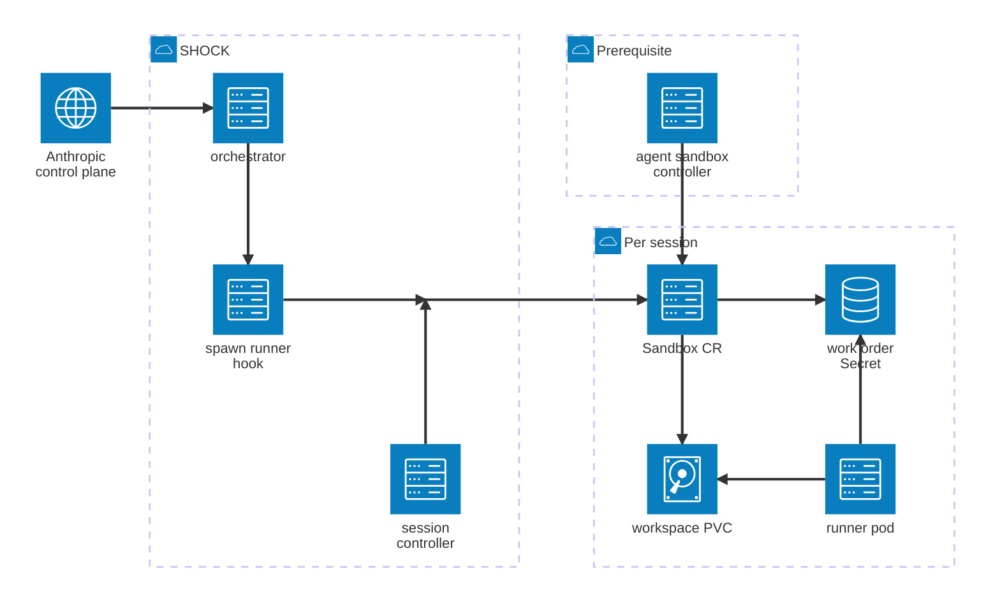
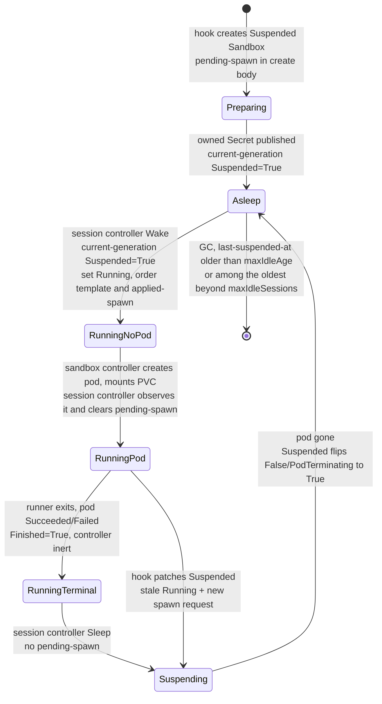

# SHOCK — Self-Hosted Orchestrator for Claude on Kubernetes

Spec: Helm chart + companion controller for suspend/resume Claude Code self-hosted runners.

Status: draft for implementation · License: Apache-2.0 (open source) · Target: in-support upstream Kubernetes (kubeVersion policy in [section 4](#4-deliverable-a--helm-chart))
Implementation agent: Claude Code. Read this whole document before writing code.

## 1. Goal

Package, as one Helm chart plus one small companion controller, an on-demand Claude Code
self-hosted runner environment where **every user session gets a persistent per-session disk
that survives sleep and reattaches on resume**, with scale-to-zero between messages.

The design was validated against Anthropic's docs and the agent-sandbox controller source.
Do not re-litigate the architecture; implement it. Where this spec says "verify", re-check the
live doc/source at implementation time (both products are beta and move quickly).

## 2. Architecture (fixed decisions)

Components, per environment:

1. **Anthropic orchestrator** (`claude self-hosted-runner orchestrator`) — Deployment, 2 replicas.
   Holds the environment secret. Its only extension point is the required `spawn-runner` hook;
   it receives no other lifecycle events.
2. **spawn-runner hook** — `shock hook spawn-runner`, a subcommand of the same Go binary as the
   session controller, reached through `/hooks/spawn-runner` **baked into the image** (a symlink to
   the `shock` binary, which runs the hook when invoked under that name). Nothing is mounted at `/hooks`. Executed by
   the orchestrator once per spawn request. It only *declares* state (create/patch Sandbox, write
   work-order Secret, stamp `pending-spawn` annotation) and exits fast. It never waits for pods.
3. **agent-sandbox controller** (kubernetes-sigs/agent-sandbox, v1beta1 API) — **hard prerequisite,
   never vendored or installed by this chart**; the operator installs it from upstream releases.
   One `Sandbox` per Claude session; PVC per session via `volumeClaimTemplates`.
4. **session-controller** (Go, controller-runtime; same binary and image as the hook, run as its
   own Deployment) — the single sequencer for sleep and wake. Bridges "runner process ended" →
   `operatingMode: Suspended` and "pending-spawn declared + suspension confirmed" →
   `operatingMode: Running`.
5. **Runner pods** — created by the sandbox controller from the Sandbox `podTemplate`; run
   `claude self-hosted-runner --capacity 1` against the per-session work-order JWT, on the
   per-session PVC. `restartPolicy: Never`. No service-account token. No sidecars.



The Sandbox owns the PVC and all of its immutable per-order Secrets. Deleting the Sandbox
cascades to those resources. No SHOCK component talks to another directly: every relation between them passes
through a Kubernetes object, which is what lets the hook write and exit without waiting on the
session controller. The junction is where the hook and the session controller both write the same
Sandbox.

Four relations are omitted, because the notation gives each node only four attachment points and
no edge labels: the hook also creates immutable work-order Secrets, the agent-sandbox controller also
creates and deletes the Pod and creates the PVC, and the runner pod registers and polls the control
plane directly.

### Session lifecycle (normative)

States are the observable combination of `spec.operatingMode`, the Sandbox's conditions, its
SHOCK annotations, and owned Pod existence — not `operatingMode` alone. The two easily-missed
states are `RunningTerminal` (a finished pod that the sandbox controller will not replace) and
`Suspending` (the pod is gone from intent but not yet from the API).



`RunningPod` means that the order has produced a new owned runner Pod and SHOCK has acknowledged
its creation. It does **not** mean that the Pod is Ready or that the Claude runner has registered
with the control plane. A Pod that was created and failed quickly can pass through this state
immediately into `RunningTerminal`. Kubernetes readiness is observational only and never drives a
SHOCK lifecycle transition.

`Suspending` has no edge back to `RunningPod`: the Wake predicate gates on `Suspended` reaching
`True` for the current generation while the spec requests suspension, so a wake cannot fire while the previous pod is still terminating. That is the fail-closed
property the session controller depends on.

**Bounce** — used throughout this document — means driving a session from `Running` through
`Suspended` and back. That round-trip is the only way to replace a pod: the sandbox controller
never replaces one on its own while `operatingMode` stays `Running`, so a session whose pod is
terminal or stale can only be restarted by suspending it first.

The hook never waits for a pod — it writes the work-order Secret and declares intent, then exits;
every transition on the diagram is driven by the session controller or the sandbox controller. The PVC and
the Sandbox object survive every edge except the last, so a resumed session finds its canonical
clone already on disk and does a fetch + hard reset rather than a fresh clone. Hook branches are
specified in [section 6](#6-deliverable-b--spawn-runner-hook); predicates in
[section 7](#7-deliverable-c--session-controller-go).

Facts this relies on (verified against `controllers/sandbox_controller.go` @ main, 2026-08):
the controller never deletes/recreates a terminal pod while `operatingMode: Running`; the
`Suspended` branch deletes the pod regardless of phase (ownership + DeletionTimestamp checks
only); resume recreates the pod from `podTemplate` and re-uses the deterministic PVC
(`<claimTemplate>-<sandboxName>`); `Finished` is present-only-while-applicable; two owned pods
-> `Ready=False/MultiplePods` and the controller refuses to act. Pin the agent-sandbox version
and encode these behaviors as e2e conformance tests ([section 12](#12-testing-and-acceptance-criteria)) so upgrades that break them fail CI.

### Why Sandbox and not Job + PVC (rationale, do not re-litigate)

A plain `Job` per run against a session-named PVC is the obvious alternative and is rejected for
one decisive reason: **the hook must exit fast and never wait for pods** ([section 6.3](#6-deliverable-b--spawn-runner-hook)). Starting a run for
an existing session under Job semantics requires deleting the prior Job and waiting for its pods to
fully terminate before creating the next one — Job specs are immutable, so there is no declarative
"make this run" target to converge on, and that wait cannot be deferred out of the hook. The Sandbox
split is what makes a fast hook possible: the hook *declares* (`pending-spawn`), the session controller
*sequences*. Secondarily, `Suspended=True` is a controller-provided "the old pod is gone" barrier
that a Job design would force the hook to synthesize itself.

### Non-goals (do not implement)

- Mid-session memory hibernation (protocol-impossible: ~60 s poll lease, transcript-replay resume).
- Per-account shared disks, RWX volumes, slot pools (superseded by per-session PVC + session-bound
  work orders).
- KEDA/HPA scaling of runners (the orchestrator is the autoscaler).
- In-pod sidecars or SA tokens for suspend (superseded by the external session controller).
- `shutdownTime`/`shutdownPolicy` on resumable Sandboxes (expiry short-circuits reconciliation
  until the field is cleared; GC is the session controller's job instead).
- **Any node-scoped action.** SHOCK is namespaced: it never taints, drains, cordons, or otherwise
  mutates Nodes, and never force-deletes a Pod. Recovering a stranded session is a cluster-admin
  action; SHOCK's responsibility ends at the alert ([section 7](#7-deliverable-c--session-controller-go) Zombie, [section 11](#11-monitoring)).
- **`spec.autoSuspension`**. Never set it; SHOCK's sleep decision belongs to the session controller.
  See [section 13.7](#13-open-items-to-verify-during-implementation-do-first).
- **A SHOCK-operated egress proxy or per-Pod sidecar for credential injection.** Cilium's per-node
  Envoy rewrites headers from Secrets under TLS interception ([section 9](#9-secret-injection-cilium-mode));
  a sidecar would put the credential inside the Pod's trust boundary and need proxy variables that
  tools ignore.

## 3. Repository layout

```
shock/
├── charts/shock/          # the Helm chart (deliverable A)
│   ├── Chart.yaml  values.yaml  values.schema.json
│   ├── templates/  (see [section 4](#4-deliverable-a--helm-chart))
│   └── README.md   (rendered install/upgrade/ops doc)
├── cmd/shock/                      # one binary, two subcommands: `hook spawn-runner`, `session-controller`
├── internal/naming/                # [section 5](#5-naming-and-metadata-conventions-normative) names, labels, annotations — shared by hook and session controller
├── internal/hook/                  # deliverable B
├── internal/sessioncontroller/            # deliverable C
├── images/orchestrator/Dockerfile  # multi-stage: builds cmd/shock, COPYs it beside `claude`,
│                                   # links /hooks/spawn-runner to it; one image serves
│                                   # orchestrator, hook, and session controller
├── test/e2e/                       # kind-based e2e incl. agent-sandbox conformance ([section 12](#12-testing-and-acceptance-criteria))
├── test/e2e-cilium/                # secret injection: CRD conformance under envtest, header rewrite on a Cilium cluster ([section 9](#9-secret-injection-cilium-mode))
├── test/runner/                    # the runner entrypoint's egress-CA trust wiring ([section 9](#9-secret-injection-cilium-mode))
├── LICENSE  README.md  CONTRIBUTING.md   # OSS hygiene: Apache-2.0, quickstart, dev guide
└── .github/workflows/              # lint (ct), unit, e2e, image build+sign
```

The runner image is **an input with a default**: the chart takes `runner.image` as a value and
defaults it to `images/runner/Dockerfile`, published alongside the orchestrator image and pinned by
digest in the released chart. The default follows the deploy doc's recipe plus user-space package
managers (mise, uv) so sessions install tooling without root; operators build their own image
`FROM` it. Document the contract in the chart README: contains `claude` (pinned version ≥ the beta
minimum), git ≥ 2.32, a non-root user with writable `$HOME` and `/workspace`, and an optional
wrapper at a known path for agent-visible credentials, and the egress-CA contract that secret
injection adds ([section 9](#9-secret-injection-cilium-mode)).

## 4. Deliverable A — Helm chart

Chart name `shock`, apiVersion v2. **agent-sandbox is a prerequisite, not a dependency**: the
chart never vendors, renders, or owns its CRDs or controller (CRD lifecycle belongs to exactly
one owner; a chart that ships someone else's CRDs breaks that owner's upgrades). Instead: link
to https://github.com/kubernetes-sigs/agent-sandbox for installation and let it own its own
instructions. **No preflight hook Jobs**: the chart
must install cleanly on a cluster where the CRD is absent, so the prerequisite is surfaced at
runtime only — the session controller checks via the discovery API at startup that
`sandboxes.agents.x-k8s.io` serves `v1beta1`, and while it is missing stays alive but not-Ready
with a clear log line and re-checks on an interval (no CrashLoopBackOff); the spawn-runner hook
maps a missing CRD to exit 1 (retryable), so queued sessions back off and recover on their own
once the prerequisite lands. `helm template` and `helm install` must both succeed without the
CRDs present so GitOps engines can converge in any order.

Kubernetes version support is **derived, not invented**: agent-sandbox publishes no compatibility
matrix, so set `Chart.yaml` `kubeVersion` to `>= <M>.<m>-0` where `<M>.<m>` is two minors below
the `k8s.io/*` library version pinned by the lowest tested agent-sandbox release (e.g. libraries at
v0.36.x -> `>=1.34.0-0`), matching upstream's supported-skew window. Re-derive on every
agent-sandbox bump; CI e2e runs against the oldest and newest allowed minors. The controller only
uses GA core APIs, so document in the README that older clusters may work but are untested and
unsupported.

`Chart.yaml` also carries `annotations.shock.invalid/claude-code-version`, the Claude Code release
both images bundle (`ARG CLAUDE_CODE_VERSION`, mirrored into an image label of the same name), so
`helm show chart` answers the question without pulling an image. `hack/bump-claude.sh` moves all
three together and its `check` mode, run in CI, fails when they disagree.

### Templates

| Template | Requirements |
|---|---|
| `orchestrator-deployment.yaml` | 2 replicas (value), `claude self-hosted-runner orchestrator --hooks-dir /hooks --environment-secret-file /secrets/environment-secret --expected-spawn-seconds N --hook-timeout N --hook-concurrency N --health-port 8080`. Env secret from `existingSecret` or chart-managed Secret. **Nothing mounts at `/hooks`** — the hook entry point ships in the image; a mount there would shadow it. The Sandbox template ConfigMap mounts read-only at `/etc/shock`. PDB minAvailable 1. Anti-affinity across nodes. Enforce at template level: `hookTimeout + 5 < expectedSpawnSeconds` (the process enforces it at startup; fail earlier in `helm template` via `fail`). |
| `orchestrator-rbac.yaml` | ServiceAccount + namespaced Role/RoleBinding for the hook: `sandboxes` get/list/create/patch (list only for the active-session cap); `secrets` get/create (ownerReference is included at creation; restrict with a name-prefix convention documented in README; K8s RBAC cannot prefix-match — mitigate by dedicating the runner namespace). |
| `sandbox-template-configmap.yaml` | One key, `sandbox-template.yaml`: the Sandbox manifest **fully rendered by Helm** — values, the `runner.podTemplate` merge, and the [section 5](#5-naming-and-metadata-conventions-normative) label literals all resolved at chart render time. Mounted read-only at `/etc/shock`. The hook unmarshals it into a typed `Sandbox` and fills in only the session-specific identity fields. Helm does value merging; Go does typed apply; neither reimplements the other. |
| `session-controller-deployment.yaml` | 1 replica, `strategy: Recreate` (no leader election — every mutation uses the concurrency preconditions in section 6, including GC, so brief overlap during rescheduling is safe), image = `orchestrator.image`, command `shock session-controller`. `SHOCK_RELEASE` from `.Release.Name` ([section 7](#7-deliverable-c--session-controller-go) selector). Readiness/liveness: controller-runtime's `/readyz` and `/healthz` on the manager's health port; readiness gated on the informer cache having synced and the CRD being served. Requests ≤50m/64Mi. |
| `session-controller-rbac.yaml` | `sandboxes` get/list/watch/patch (+delete for GC); `secrets` get (immutable order verification only — **never** `delete`; all order Secrets are reaped by ownerReference when the Sandbox goes); `pods` get/list/watch (spawn observation and zombie *detection* only — **never** `delete`; see [section 7](#7-deliverable-c--session-controller-go)); `events` create/patch. No leases. |
| `runner-networkpolicy.yaml` | See [section 10](#10-network-policy-cilium-mode). Rendered per `network.mode: cilium|kubernetes|none`. With `secretInjection.enabled`, the runner policy carries one interception rule per injected host ([section 9](#9-secret-injection-cilium-mode)). |
| `secret-injection.yaml` | Gated by `secretInjection.enabled`. Under `pki: managed`, four namespaced cert-manager objects: a self-signed `Issuer`, a CA `Certificate` with `isCA`, a CA `Issuer`, and a leaf `Certificate` whose `dnsNames` are the injected hosts. Under `pki: existing` with `ca.bundle` set, a ConfigMap holding the CA's public certificate. Unless `upstreamCA.existingSecret` overrides it, the `originatingTLS` Secret from `files/upstream-ca-bundle.pem`. With a non-empty `clientConfigs`, the placeholder configs ConfigMap for `/etc/shock/registries`. No template ever writes a credential or a private key, and no template is cluster-scoped. |
| `podmonitor.yaml`, `prometheusrule.yaml` | [section 11](#11-monitoring). Gated by `monitoring.enabled`. |
| `_helpers.tpl` | `shock.fullname`, `shock.labels`, `shock.selectorLabels` ([section 5](#5-naming-and-metadata-conventions-normative)). Every template uses them; no template writes a label literal. |

### values.yaml (sketch — authoritative shape, extend as needed)

```yaml
environment:
  existingSecret: ""            # Secret with key environment-secret; required if secretValue unset
orchestrator:
  image: {repository: "", tag: ""}   # required
  replicas: 2
  expectedSpawnSeconds: 180     # p99 wake incl. session-controller latency + pod start + image pull
  hookTimeout: 30
  hookConcurrency: 4
  maxActiveSessions: 2          # hook exits 1 for a new session beyond it ([section 6](#6-deliverable-b--spawn-runner-hook), 2f); 0 = unlimited
sessionController:
  resyncSeconds: 300                       # informer resync backstop; reconcile is event-driven
  gc: {enabled: true, maxIdleAge: 336h, maxIdleSessions: 10}  # delete Sandbox+PVC after 14 d asleep, or the oldest beyond 10 asleep
  zombie: {enabled: true, alertAfter: 5m}  # alarm-only threshold; the session controller never deletes pods
runner:
  image: {repository: "", tag: ""}   # required; contract in README
  baseDir: /home/runner/workspace   # --base-dir; at or below storage.mountPath
  runtimeClassName: ""          # e.g. kata / gvisor; empty = runc
  terminationGracePeriodSeconds: 120   # ≥ effective SIGKILL floor (75 s; 105 s with push-outcome)
  flags:
    releaseIdleSessionMin: 30
    killSessionAfterMin: 480
    exitIfUnusedMin: 10
    pushOutcomeOnRelease: true
  storage:
    mountPath: /home/runner       # the PVC is the runner's home; baseDir lives inside it
    className: ""
    size: 20Gi
    accessMode: ReadWriteOncePod   # double-writer guard ([section 7](#7-deliverable-c--session-controller-go)); immutable after creation, see [section 5](#5-naming-and-metadata-conventions-normative)
  resources:                    # Anthropic's per-session starting values (deploy doc, "Size CPU and memory");
    requests: {cpu: "2", memory: 4Gi}   # memory request = limit, CPU bursts for builds
    limits: {cpu: "4", memory: 4Gi}
  extraEnv: []                  # e.g. CLAUDE_ENV_FILE, mirror URLs
  extraVolumes: []              # e.g. a Secret for an agent-visible wrapper credential ([section 9](#9-secret-injection-cilium-mode), option 3)
  extraVolumeMounts: []
  instructions: |               # rendered into a ConfigMap and mounted read-only at
    # This runner environment    # /etc/claude-code/CLAUDE.md, Claude Code's managed-policy
    ...                          # instructions loaded into every session; "" mounts nothing
  podTemplate: {}               # strategic-merged into the Sandbox podTemplate by Helm;
                                # the hook forces the load-bearing fields afterwards (section 6)
network:
  mode: cilium
  allowedFQDNs:                 # host or host:port; port defaults to 443. One list for every
    - api.anthropic.com         # egress destination: Anthropic, git hosts, package registries.
    - github.com                # Extend per the deploy doc's egress list at implementation time.
secretInjection:                # section 9; requires network.mode: cilium
  enabled: false
  placeholder: proxy-injected   # the literal configs and the agent use in place of a token
  pki: managed                  # managed = cert-manager issues the CA and certificate; existing = you supply them
  certManager:                  # pki: managed only
    caDuration: 87600h
    certDuration: 2160h
    certRenewBefore: 360h
    issuerAnnotations: {}
  upstreamCA:                   # originatingTLS roots; unset ships Mozilla's list (section 9)
    existingSecret: {namespace: "", name: ""}   # override: Secret with key ca.crt
  tls:                          # pki: existing only
    certificateSecret: {namespace: "", name: ""}   # kubernetes.io/tls with a SAN per injected host
  ca:                           # pki: existing only; how the runner trusts the interception CA
    existingConfigMap: ""       #   ConfigMap in the release namespace, key ca.crt
    bundle: ""                  #   inline PEM, rendered into a chart ConfigMap
  credentials:
    - name: ghcr                                   # RFC 1123, unique; part of rendered names
      host: ghcr.io                                # exact lowercase FQDN on 443; no wildcard, no port
      secret: {namespace: "", name: ""}            # exactly one key; the value is the whole header value
      header: Authorization                        # default
      paths: ["/token(\\?.*)?"]                    # regexes; empty = every request to the host
      methods: []                                  # regexes; empty = every method
  clientConfigs: {}             # filename -> contents; mounted read-only at /etc/shock/registries; placeholder only
monitoring: {enabled: true}
```

Ship `values.schema.json` covering every key above (types, required, enums). Lint with
`ct lint` in CI.

## 5. Naming and metadata conventions (normative)

- Sandbox name: `<release>-cs-<sanitized-session-id>` (`cs` for Claude session; the control
  plane's ids arrive as `cse_...`). Both parts RFC 1123 sanitized (lowercase, `[a-z0-9-]`); the
  release part cut to 24 chars, the id part to what fits in 63 with a `-<8-char fnv hash of raw
  id>` suffix, appended when the id was truncated or altered.
- Work-order Secret name: `<release>-wo-<sha256(release, session-id, Sandbox UID, order-id)>` (`wo` for
  work order; release part sanitized and cut like the Sandbox name's) using the full
  lowercase hex digest of an unambiguous length-prefixed encoding. Include the Sandbox UID so
  recreation cannot reuse a Secret owned by a deleted Sandbox. Set `immutable: true`, key
  `work-order`, and annotations for raw order ID, attempt, and session ID; never log the JWT. Mounted at
  `/var/run/claude/work-order`; runner flag `--environment-secret-file /var/run/claude/work-order/work-order`
  (for orchestrator-spawned runners this flag carries the single-use work-order JWT).
- PVC: claim template named `workspace` -> PVC `workspace-<sandboxName>` (controller-derived; do
  not name it yourself). Access mode comes from `runner.storage.accessMode`, default
  `ReadWriteOncePod`. **Decide this before first install**: `volumeClaimTemplates` is immutable
  after Sandbox creation, so existing sessions keep whatever mode they were born with and can only
  be changed by recreating the session.
- **Common labels — on every resource the chart creates or renders, without exception**
  (`templates/_helpers.tpl`, one `shock.labels` and one `shock.selectorLabels` helper):

  ```yaml
  app.kubernetes.io/name: orchestrator | session-controller | runner   # per resource
  app.kubernetes.io/instance: {{ .Release.Name | quote }}
  app.kubernetes.io/version: {{ default .Chart.AppVersion .Values.orchestrator.image.tag | quote }}
  app.kubernetes.io/managed-by: {{ .Release.Service | quote }}
  app.kubernetes.io/part-of: shock
  helm.sh/chart: {{ printf "%s-%s" .Chart.Name .Chart.Version | replace "+" "_" | quote }}
  ```

  `name` is the component; `part-of` is the system it belongs to. There is deliberately **no**
  `app.kubernetes.io/component` — with `name` carrying the component it would be a second label
  holding the same value, and a selector built on both would be one more immutable field to get
  wrong.

  `shock.selectorLabels` is the **fixed subset** `name` + `instance`: which component, and which
  release. Selector fields are immutable after creation (Deployment `spec.selector`, PodMonitor,
  NetworkPolicy), so this subset is frozen now. `version` and `helm.sh/chart` change on every
  upgrade and must never appear in a selector.
- **Release scoping (normative).** `app.kubernetes.io/instance` carries `.Release.Name` on every
  object, and **every selector in the chart includes it**, so two releases can co-exist in one
  namespace without one release's session controller acting on the other's sessions. `part-of` is a
  constant across releases and must never be used as a selector on its own.
- **Sandbox labels.** The hook renders Sandboxes from a template Helm has already expanded, so the
  literal label values are baked into the ConfigMap at chart render time — the hook does not
  compute them. The full common set (with `name: runner`) plus `shock.invalid/session-id` and
  `shock.invalid/account-id` goes in **both** places:
  - `metadata.labels` on the Sandbox CR — what the session controller lists on.
  - `spec.podTemplate.metadata.labels` — what the runner Pod is created with.

  These are separate: labels on a Sandbox CR are **not** propagated to its Pod. Anything that
  selects pods (PodMonitor, NetworkPolicy) sees only the podTemplate set.
- **Object names must be release-scoped too.** Labels alone do not make two releases safe in one
  namespace: a bare `cs-<session-id>` would collide if two releases were
  offered the same session. Order Secret names hash the release and Sandbox UID, and Sandbox
  names carry the release name as prefix (decided 2026-09-15; the first
  implementation shipped bare `cs-` names, so a release upgraded across that change creates
  new Sandboxes for existing sessions and GC reaps the old ones). The Sandbox
  name is the PVC name stem and cannot be changed for an existing session.
  Never label/annotate with the account **email** (PII); use the stable account ID.
- Annotations on Sandbox:
  - `shock.invalid/pending-spawn` = current order id whose new runner Pod has not yet been observed.
  - `shock.invalid/pending-spawn-at` = UTC RFC 3339 time at which that pending order was written;
    this is the source for pending-spawn age metrics and alerts.
  - `shock.invalid/applied-spawn` = most recent order id for which `operatingMode: Running` has been
    issued. Initially absent; the session controller sets it during Wake only after
    current-generation `Suspended=True`.
  - `shock.invalid/pending-secret` = immutable Secret name for pending-spawn; cleared on acknowledgement.
  - `shock.invalid/last-order-id` = highest accepted order ID, retained after acknowledgement.
  - `shock.invalid/last-order-attempt` = highest accepted session attempt, retained after acknowledgement.
  - `shock.invalid/last-order-secret` = Secret for the highest accepted order, retained for redelivery repair.
  - `shock.invalid/order-id` on the Pod template = order assigned to that Pod, stamped with its Secret reference.
  - `shock.invalid/last-suspended-at`.

## 6. Deliverable B — spawn-runner hook

`shock hook spawn-runner`, invoked through the `/hooks/spawn-runner` symlink shipped in the image.
Shares
`internal/naming` with the session controller, so the names and labels the hook writes and the selector
the session controller lists on cannot drift — [section 5](#5-naming-and-metadata-conventions-normative)'s sanitize/truncate/hash rule has exactly one
implementation. Chart values reach it as env vars on the orchestrator Deployment; the Sandbox
shape comes from the Helm-rendered `/etc/shock/sandbox-template.yaml` ([section 4](#4-deliverable-a--helm-chart)). Inputs are the
env vars the orchestrator sets — **verify exact names against the on-demand-runners doc page at
implementation time** (beta): work-order file path (file is deleted when the hook exits — copy it
out), order id (documented as safe for Kubernetes resource names), session id/uuid (empty for
pre-warm requests), account id (stable, non-PII), account email (PII — never log), primary repo
URL, attempt counter.

Behavior:

1. **Standby (pre-warm) request** (empty session id): exit 2 with a clear log line. The
   orchestrator only dispatches these with `--min-idle > 0`, which the chart never sets: a
   standby runner is unbound and cannot have a per-session disk, so SHOCK does not run them
   (removed 2026-09-15; warm first spawns come from a checkout baked into the runner image
   instead, per Anthropic's "reuse a pre-warmed checkout").
2. **Session-bound request**:
   a. Validate inputs and the fully rendered template before writing resources. Read the Sandbox
      directly from the API. Verify release/session identity and reject an object with a
      `deletionTimestamp` with exit 1; never accept work onto a deleting Sandbox.
   b. **Sandbox absent** — create it once with `operatingMode: Suspended`, pending-spawn,
      pending-spawn-at, last-order-id, and last-order-attempt in the create body; applied-spawn
      is absent. The suspended template contains a reserved placeholder Secret reference that
      is never materialized. After receiving the Sandbox UID, derive and create the owned immutable
      Secret, then conditionally record pending-secret and last-order-secret. Wake installs the
      real Pod template reference and issues the first Running only after preparation completes.
      Apply all template-contract fields, workspace claim template, configured runner flags, and
      account lock before creation. Include this initial suspension round-trip in the spawn budget.
      On AlreadyExists, re-read and take the existing-object path; never overwrite the winner.
   c. **Sandbox exists** — compare the request with last-order-attempt and last-order-id.
      A lower attempt is superseded: exit 0 without writing a Secret or changing intent. The same
      attempt and ID is redelivery: ensure the accepted immutable Secret exists and matches its
      owner and identity before exiting 0, without re-arming pending-spawn. A different ID at the
      same attempt is a protocol error (exit 2). For a higher attempt, create its immutable Secret
      with the existing Sandbox UID as owner, then conditionally patch pending-spawn,
      pending-spawn-at, pending-secret, last-order-id, last-order-attempt, and last-order-secret
      together. Set operatingMode to Suspended in that patch, but leave applied-spawn and the
      Pod template's current order/Secret untouched. Wake installs the new template only after
      suspension is confirmed. Re-read and re-evaluate on conflict; never replay a stale patch.
   d. **Secret creation and recovery.** Use Create, never apply or overwrite JWT data. Include a
      non-controller ownerReference to the Sandbox UID in the create body, with
      `blockOwnerDeletion: false`. On AlreadyExists, verify immutable data, order identity, and
      owner UID; a mismatch is exit 2. Fresh-session preparation derives and records the Secret
      name from the accepted order and Sandbox UID, creates that owned Secret, then conditionally
      records the pointers before success.
      Redelivery of the accepted order repairs incomplete preparation, including missing pointer
      annotations only while this order remains pending, but never recreates a workload for an acknowledged order. If a newer order
      wins during preparation, stop publishing the older order. Every created Secret is already
      owned, including those left by a losing hook; retain them until Sandbox GC. This consumes
      one Secret per attempted order during the session's lifetime; document the quota impact.
      A failed validation or missing CRD creates no Secret. A crash before Sandbox creation creates
      nothing; a crash afterwards leaves recoverable pending intent, never an unowned Secret.
   e. Exit codes per the documented contract: 0 = submitted or superseded; 1 = retryable;
      ≥2 = circuit-broken until an admin retries. Transient API errors, missing CRD, deletion in
      progress, or conflicts exceeding the bounded API retry budget → 1. Validation, RBAC,
      template, identity, or immutable Secret mismatch errors → 2. Total runtime stays below
      hookTimeout; retries cover API conflicts only, with no waits or polls for Pods or conditions.
   f. **Active-session cap** (`orchestrator.maxActiveSessions`, default 2, 0 = off). Before creating a
      Sandbox (2b) or publishing a newer order (2c), list the release's Sandboxes and count those
      not deleting that are `Running` or carry pending-spawn, excluding the session's own. A
      session whose own Sandbox holds a slot is a bounce and passes. At the cap, exit 1 with
      "at capacity: N of N sessions are active" on stderr and write nothing: the control plane
      shows that reason to the user and re-offers the order after its backoff. Redelivery (2c,
      same order id) and superseded orders never reach the check. The count is a snapshot
      without a lock: concurrent hooks can overshoot by up to hookConcurrency per replica, so
      the cap is soft. Exit 2 is deliberately not offered: it blocks the session until an
      organization Owner presses Retry, which the session creator cannot do.

### Concurrency protocol (normative)

Hook invocations across replicas are concurrent writers. The Sandbox is the single commit point
for accepted order identity. Every patch to an existing Sandbox uses its observed UID and
resourceVersion as API-enforced preconditions (JSON Patch tests or an equivalent optimistic-lock
patch). Patch only the intended fields. On conflict, re-read and recompute the whole decision;
never force apply or retry the old payload. Once an invocation has observed a Sandbox UID,
a missing object or changed UID ends that invocation with exit 1; it must not silently recreate it. This applies to hook preparation/publication and to
Spawn observation, Sleep, and Wake. A cache read is permitted for reconciliation, but does not
replace mutation preconditions. Ignore deleting Sandboxes in all lifecycle actions.

Order precedence uses the control plane's per-session attempt counter, not completion time,
lexicographic order ID, or local clocks. Verify that the pinned protocol guarantees increasing
attempts for new orders and stable attempts for redelivery before implementation; lack of that
guarantee blocks this protocol and requires an explicit replacement. Order IDs remain dedup keys.
A Secret is immutable and owned before publication; Wake validates the referenced Secret against
the accepted order, attempt, session, and Sandbox UID. The hook never rotates an existing Pod's JWT.

GC uses both UID and resourceVersion delete preconditions. A concurrently accepted spawn changes
the resourceVersion and defeats the stale delete. If deletion wins first, hook publication must
fail and return retryable; it must not report successful submission onto the deleting object.
An expiry deletion that wins this race is final: later recreation starts with a new disk. Document
this retention boundary. Secret creation racing deletion remains owned by the old UID and is GC'd.

### Template contract (normative)

The hook strict-decodes `/etc/shock/sandbox-template.yaml` into a typed `Sandbox` — an unknown
field is an error, not a silent drop — then stamps identity onto it. Helm has already merged
`runner.podTemplate`; the hook never merges anything, so no strategic-merge logic exists in Go.

**Required anchors.** The hook locates these by name to inject per-session data Helm cannot know.
Missing or renamed by a user's `runner.podTemplate` -> exit 2 with a message naming the anchor:

| Anchor | Why the hook needs it |
|---|---|
| container named `runner` | appends `--lock-to-account <account-id>`; forces the workspace mount |
| volume named `work-order` | provides the work-order mount; Wake sets `secret.secretName` to pending-secret |

**Forced fields.** Applied after the merge, so a `runner.podTemplate` cannot break them — last
write wins, no error, no way to opt out:

| Field | Forced to | Breaks if wrong |
|---|---|---|
| `podTemplate.spec.restartPolicy` | `Never` | pod never reaches a terminal phase, `Finished` never appears, the session never sleeps |
| `podTemplate.spec.automountServiceAccountToken` | `false` | hands every session a token the design withholds |
| `podTemplate.metadata.labels` | the [section 5](#5-naming-and-metadata-conventions-normative) common + session set, merged last | PodMonitor and NetworkPolicy stop selecting the pod |
| `runner` container's `workspace` volumeMount `mountPath` | `runner.storage.mountPath` (the runner's home); `runner.baseDir` must be at or below it, else exit 2 | warm start silently becomes a fresh clone every session |
| `podTemplate.spec.terminationGracePeriodSeconds` | `runner.terminationGracePeriodSeconds` | SIGKILL before the runner finishes releasing its session |
| `spec.operatingMode` on creation | `Suspended` | no Pod may start before owned order preparation completes |

Users keep everything else: `resources`, `nodeSelector`, `tolerations`, `affinity`,
`priorityClassName`, `imagePullSecrets`, `serviceAccountName`, `securityContext` (notably
`fsGroup`, which a non-root runner needs to write to a fresh PVC), extra labels and annotations,
and additional volumes and mounts. Labels merge rather than replace, so users can add their own
without displacing the selector set.

The `workspace` **volume** is not in the podTemplate — the sandbox controller derives it from
`volumeClaimTemplates`. Only the mount is the hook's business.

3. Hard requirement: total runtime well under `orchestrator.hookTimeout`; no waits, no polls.

## 7. Deliverable C — session-controller (Go)

A controller-runtime controller (`shock session-controller`, logic in `internal/sessioncontroller`), built from
the same module as the hook and shipped in the same image, run as a 1-replica Deployment. It
imports the agent-sandbox `v1beta1` types directly, so a renamed field or condition constant is a
build failure at bump time rather than a silent runtime no-op — the guarantee [section 12](#12-testing-and-acceptance-criteria)'s conformance
suite reaches for, obtained earlier and for free.

Watches `Sandbox` and owned runner Pods with the informer cache restricted by
`shock.selectorLabels` ([section 5](#5-naming-and-metadata-conventions-normative)) plus
`name: runner`, `SHOCK_RELEASE` supplying `.Release.Name`, so only this release's sessions and Pods
are cached. Pod events enqueue their owning Sandbox for spawn observation and zombie detection.
Two releases in one namespace therefore never act on each other's work.
Reconciliation is event-driven, with `sessionController.resyncSeconds` as a resync backstop; requeues use
controller-runtime's default rate limiter. No leader election: 1 replica, `strategy: Recreate`, and
every mutation uses the concurrency preconditions in section 6, including GC, so brief overlap during rescheduling is safe.
Work-order Secrets are read through an uncached reader so the controller does not hold every Secret
in the namespace in memory.

**Normative reading rule — require current status as well as matching intent, never condition presence alone.**
`spec` is what was asked for; `status` is what the controller has achieved. Three traps, each with a
mandatory test below:

1. A condition's *presence* is not its *truth*. `Suspended` is never removed — it flips to
   `False / NotSuspended` while the Sandbox is Running, so a **running** Sandbox still carries a
   `Suspended` condition. Use `meta.IsStatusConditionTrue(sb.Status.Conditions, "Suspended")`;
   never branch on `meta.FindStatusCondition(...) != nil`, which is the live-session data-loss bug
   in GC below.
2. `spec.operatingMode == Suspended` is true the instant the hook patches it, while the old pod is
   still running. Only the `Suspended` **condition** reaching `True` means the pod is actually
   gone for that generation; while it is still terminating the condition reads `False / PodTerminating`.
3. A true condition may describe an earlier generation. Wake and GC require
   `spec.operatingMode == Suspended`, `Suspended=True`, and that condition's
   `observedGeneration == metadata.generation`. Sleep likewise requires a current-generation
   `Finished=True`. A stale True is not proof of the current suspension. Pin and test upstream's
   observedGeneration behavior. Mutation resourceVersion preconditions separately guard changes
   made after the read.

Per Sandbox, in order. After any state-changing patch, return and let the resulting watch event
drive the next reconcile; do not continue evaluating predicates against the pre-patch object:

- **Spawn observation**: pending-spawn present, applied-spawn equals pending-spawn, and an
  owned runner Pod (owner UID matches) exists in any phase with the same order-id annotation and
  immutable Secret reference -> conditionally remove pending-spawn, pending-spawn-at, and
  pending-secret. Never inspect Ready. Order identity on the actual Pod is required because Pod
  and Sandbox informers can advance independently; Sandbox annotations alone cannot identify it.
- **Sleep**: current-generation Finished=True, operatingMode Running, and no pending-spawn ->
  conditionally patch operatingMode Suspended and set last-suspended-at.
- **Wake**: operatingMode Suspended, current-generation Suspended=True, and pending-spawn plus
  pending-secret present -> read and validate the immutable Secret. In one conditional patch set
  operatingMode Running, applied-spawn=pending-spawn, the Pod template's order-id and Secret
  reference, and clear last-suspended-at. Keep pending intent until Spawn observation. Missing
  preparation blocks Wake and requeues with backoff; redelivery repairs preparation. Neither
  spec alone nor a True condition from an older generation permits Wake.
- **Zombie**: owned pod Terminating > `zombie.alertAfter` -> emit a Kubernetes Event and let the
  alert ([section 11](#11-monitoring)) carry it. **The session controller never deletes a pod.** Every safety net in this design
  keys off the pod object existing — the `Suspended`-true gate, and the controller's deterministic
  pod name, which makes a second create collide. Force-deleting the object defeats both at once and
  is the only way to get two pods on one PVC. Resolving a stranded session is out of scope
  ([section 2](#2-architecture-fixed-decisions) non-goals): alert and stop.
- **GC** (gated by gc.enabled): operatingMode Suspended, current-generation Suspended=True,
  no pending-spawn, and either last-suspended-at older than gc.maxIdleAge or, with
  gc.maxIdleSessions > 0, this Sandbox among the oldest asleep ones (by last-suspended-at, ties
  by name) beyond that count -> delete Sandbox with both UID and resourceVersion preconditions.
  The count comes from the informer cache and only asleep Sandboxes by the same predicate
  count. On conflict, re-read and re-evaluate; never retry an unconditional delete. The PVC
  and all immutable order Secrets cascade by ownerReference. A Sandbox pushed past the count
  by a newer one falling asleep is reached on its resync, so the count cap acts within
  resyncSeconds.
- **Alarm**: `Ready=False/MultiplePods` -> emit a Kubernetes Event once per transition.

`Ready` is monitoring-only. It is not evidence that the Claude runner registered, accepted the
work order, or is polling the control plane, and it must never clear pending-spawn or drive Sleep,
Wake, or GC. Anthropic's orchestrator/control plane owns runner-registration success and re-offers
a new work order when a runner fails; SHOCK never retries a consumed JWT based on readiness.

Error handling: return the error and let controller-runtime requeue with backoff — never swallow a
failure to keep the loop moving. Never retry a consumed JWT: once a Pod has been created for
applied-spawn, a `PodFailed` is left for the control plane's re-offer. Missing agent-sandbox CRD:
the manager reports not-ready and retries cache sync rather than crash-looping, and recovers
automatically when the CRD appears.

Stale reads must produce conflicts rather than overwrite fresher intent. In particular, an
acknowledgement of order A cannot clear order B, a stale Sleep cannot suspend a newly accepted
order, and a stale Wake cannot install an older order. Test these interleavings with overlapping
controller reconciles as well as concurrent hooks; single-replica deployment is not a lock.

Observability: the manager serves `/metrics` directly ([section 11](#11-monitoring)) alongside controller-runtime's standard
reconcile counters and latency histograms.

Testing: `golangci-lint`; `go test` against the real `v1beta1` types with
`controller-runtime/pkg/client/fake` — the full predicate matrix, redelivery, the stale-spawn
guard, applied-spawn correlation, and three mandatory cases matching the reading rule above:
(a) **woken sandbox is not GC'd** — `Suspended` present with status `False`, `last-suspended-at`
older than `gc.maxIdleAge`, no pending-spawn -> GC must not fire;
(b) **terminating pod does not wake** — `spec.operatingMode: Suspended` with `Suspended`
`False / PodTerminating` and pending-spawn present -> Wake must not fire;
(c) **old pod does not acknowledge a new order** — an owned live Pod exists and may be
`Ready=True`, pending-spawn names the new order, and applied-spawn names the prior order ->
pending-spawn must remain.

### Active-session cap (in the hook, not here)

`orchestrator.maxActiveSessions` is enforced by the hook ([section 6](#6-deliverable-b--spawn-runner-hook), step 2f), not by a
Wake gate. A controller-side gate was designed first and dropped on 2026-09-16: it would have
created a Sandbox, a provisioned PVC and one Secret per re-offer for a session that may never
run, shown the user nothing until the lease expired, and needed a queue, FIFO admission and new
metrics. Exit 1 from the hook creates nothing, surfaces "at capacity" in the Activity tab and
leaves queueing to the control plane. The price is that admission order and latency follow the
control plane's undocumented backoff, and that racing hooks can overshoot by up to
`hookConcurrency` per replica. Revisit only if that backoff proves unfit; the Wake predicate
stays the single place a controller-side gate would go.

## 8. Runner container (inside the Sandbox podTemplate)

Command (rendered from values):

```
claude self-hosted-runner \
  --capacity 1 --base-dir /home/runner/workspace \
  --environment-secret-file /var/run/claude/work-order/work-order \
  --lock-to-account $(ACCOUNT_ID) \
  --release-idle-session-min 30 --kill-session-after-min 480 \
  --exit-if-unused-min 10 --push-outcome-on-release --health-port 8080
```

Requirements: the PVC is mounted at the runner's home (`runner.storage.mountPath`) and `--base-dir`
lies inside it, so the canonical clone (`<base-dir>/<owner>/<repo>`) and everything the session
installs under `~` survive sleep -> resume is fetch + hard-reset, not a fresh clone.
Same `--base-dir` and `--capacity` on every runner in the environment (recorded absolute paths
must resolve on resume). Liveness probe on `/healthz`; note in README that it detects a dead
process only. `terminationGracePeriodSeconds` per values ([section 4](#4-deliverable-a--helm-chart)) — the runner's effective SIGKILL
floor is 75 s at defaults and higher with push-outcome enabled. `securityContext`: non-root,
no privilege escalation, seccomp RuntimeDefault; `runtimeClassName` from values.

## 9. Secret injection (Cilium mode)

Sessions need credentials for private package registries and internal HTTP APIs: GitHub Packages
(`ghcr.io`, `npm.pkg.github.com`, `nuget.pkg.github.com`, `maven.pkg.github.com`) under a classic
personal access token with `read:packages`, the only token type GitHub Packages accepts (fine-grained
tokens are a GitHub roadmap item; `GITHUB_TOKEN` exists only inside Actions). Three requirements,
all normative: **the credential is never present inside the runner container**, in any form the
session can read; **the agent sees a placeholder** wherever a token would go; **the credential is
usable only against the host, and optionally the paths and methods, it is bound to**. Anthropic-hosted
environments meet the same requirements with "API credentials": the agent proxy attaches the key to
requests for the listed hosts after each request leaves the session VM, and `gh`/`GITHUB_TOKEN`
read the literal `proxy-injected`. The cloud-environments doc states that a self-hosted environment
doesn't have API credentials. SHOCK provides them with Cilium, the chart's default network mode, and
builds no proxy of its own ([section 2](#2-architecture-fixed-decisions) non-goals).

### Mechanism (normative)

For each injected credential the runner `CiliumNetworkPolicy` carries a dedicated `toFQDNs` rule for
that host ([section 10](#10-network-policy-cilium-mode)) with `terminatingTLS`, `originatingTLS` and
an HTTP L7 rule whose `headerMatches` entry names the credential Secret with `mismatch: REPLACE`. The
node-local Cilium Envoy terminates the runner's TLS connection with a certificate for that host signed
by a deployment-internal CA, sets the header to the Secret's value (Cilium's proxy documents REPLACE
as "Replace (or add if missing) the header"; the filter logs the client's value as rejected and
writes the expected value), and opens its own TLS connection to the real host, verified against a
public CA bundle. Nothing runs in the Pod. In Cilium's SDS mode the operator copies Secrets referenced
by policy into `cilium-secrets` and Envoy receives them by reference, so the Secrets can live in any
namespace and the Cilium agent needs no cluster-wide Secret read.

Where each piece lives, and where it must never appear:

| Item | Location | Never |
|---|---|---|
| Credential value | Operator-created Secret with exactly one key whose value is the whole header value (`Bearer <PAT>`, `Basic <base64 user:PAT>`); the operator-synced copy in `cilium-secrets`; the node Envoy's memory | Sandbox or Pod spec, env, volume, PVC, ConfigMap, chart values, hook or controller logs, metrics labels, the instructions ConfigMap |
| Terminating certificate and key | `kubernetes.io/tls` Secret referenced by `terminatingTLS`; its `ca.crt` key, alone, is projected into the runner | The Pod, beyond that one key |
| Interception CA private key | A cert-manager CA `Certificate`'s Secret, or the operator's offline CA | Any Pod, any volume the chart renders |
| Upstream roots | Secret referenced by `originatingTLS`: the chart's pinned Mozilla list, or an operator override | n/a (public) |

Properties the operator must understand, stated in the README:

- **REPLACE is unconditional.** Whatever the session sends in the bound header on a matching
  request, Envoy sets the credential; a missing header is added. The placeholder is a convention
  for client configs and for the agent, not an enforcement point: Cilium matches a header against
  one expected value and cannot swap only a specific placeholder. Consequently **every process in
  the session can use the credential against the bound host and paths**, the same property
  Anthropic's API credentials have ("applies in every session that runs in the environment, whoever
  started it"). Bind narrowly: one host, `read:packages`, path-scoped where the protocol allows.
- **Only listed hosts are intercepted.** Every other destination keeps end-to-end TLS with the
  SNI check of [section 10](#10-network-policy-cilium-mode). `api.anthropic.com` can never be an
  injected host; the render fails, because the runner's control-plane and inference traffic must
  stay untouched and Claude Code's own OAuth token must never pass through a policy proxy.
- **Derived tokens may enter the Pod.** The OCI token flow exchanges `Basic` credentials on
  `GET /token` for a short-lived, repository-scoped `Bearer` JWT that the client then presents from
  inside the Pod on `/v2/...`. That JWT is the registry's own derived credential, not the PAT. Bind
  `ghcr.io` to `paths: ["/token(\\?.*)?"]` so the PAT itself never leaves the node and the JWT
  passes through the catch-all rule unmodified.
- **Trust failures are loud, not leaky.** A tool that does not trust the interception CA fails with
  a certificate error on injected hosts only; nothing is sent in the clear and no credential is
  exposed. The one configuration that *would* leak is an interception rule without
  `originatingTLS`, which the chart cannot render; see [Certificates](#certificates-normative).

### Certificates (normative)

Interception needs three pieces of PKI, and they are not interchangeable.

| Piece | What it must be | Who supplies it |
|---|---|---|
| Terminating certificate and key | `kubernetes.io/tls` Secret with a SAN for every injected host, signed by a CA the runner trusts | `pki: managed` issues it with cert-manager; `pki: existing` takes a reference |
| The CA certificate the runner trusts | The public certificate of that CA, mounted read-only into the runner | `pki: managed` takes it from the issued Secret's `ca.crt`; `pki: existing` takes a ConfigMap or an inline PEM |
| Upstream roots | The **public web PKI** roots Cilium verifies the real host against, for `originatingTLS` | The operator, always, or an opt-in trust-manager `Bundle` |

**`pki: managed` is the default and needs no certificate work from the operator.** The chart renders
four namespaced cert-manager objects: a self-signed `Issuer`, a CA `Certificate` marked `isCA`, a CA
`Issuer` over the resulting Secret, and a leaf `Certificate` whose `dnsNames` are exactly the injected
hosts. Adding a host to `secretInjection.credentials` therefore reissues the certificate with the new
SAN, and cert-manager rotates it on its own schedule; nothing in SHOCK tracks expiry. The runner
mounts the leaf Secret's `ca.crt` **and only that key**, through a volume `items` selector, so the
leaf private key is never projected into the Pod and the CA key Secret is never referenced by a Pod
at all. cert-manager is a prerequisite for this mode, in the same sense that Cilium is a prerequisite
for `network.mode: cilium`: injection is opt-in, so the chart fails the render rather than degrading.

**The upstream roots ship with the chart, pinned by digest.**
`files/upstream-ca-bundle.pem` is Mozilla's CA list exactly as `curl.se`
publishes it. `hack/update-ca-bundle.sh` fetches it from a fixed URL and verifies
it against the digest published beside it, records that digest in the file's
header, and refuses to write on a mismatch. It never reads the local trust store,
which is the defect that produced the first implementation's bundle. A `check`
mode re-verifies the committed file offline; `make all` and CI both run it, so a
hand-edited file fails the build, and a chart golden test repeats the check and
additionally rejects subject strings that would mean an interception CA got in.
`secretInjection.upstreamCA.existingSecret` overrides the whole thing for an
internal PKI or an operator's own vetted roots.

The chart renders no trust-manager `Bundle`. A `Bundle` with `useDefaultCAs` is a
reasonable way for an operator to produce the override Secret, and the README
shows it, but it is cluster-scoped and its Secret target requires trust-manager's
`secretTargets.enabled`, which widens that controller's access to Secrets. Both
are the operator's decision to make, not the chart's, and keeping it out leaves
every object this chart creates namespaced.

**What makes the shipped bundle acceptable is provenance, not good intentions.** The first
implementation vendored a bundle too, and it carried six TLS-interception CAs, because the generator
read the build host's trust store; see the verification record. Three structural differences, all of
them checkable by a reviewer who reads none of the certificates: the source is a fixed published URL,
the content is verified against a digest that URL publishes, and that digest is recorded in the file
and re-verified by `make all`, by CI and by a golden test. A reviewer checks one hex string against
`curl.se`, not 3700 lines of base64.

**Rendering without upstream roots is refused, and that is a safety property, not tidiness.** Cilium
treats a matched rule carrying no `originatingTLS` as permission to use a raw socket upstream: in
`PortPolicy::getClientTlsContext`, `raw_socket_allowed` is true when the verdict is Allow and no
client TLS context exists, and the wrapper then takes `Network::RawBufferSocket`. Paired with
`terminatingTLS` that means Cilium decrypts the runner's request, **injected credential included, and
forwards it in cleartext**. So every interception rule the chart renders carries `originatingTLS`
unconditionally, and the render fails when neither upstream source is configured.

**ClusterTrustBundle was considered and deferred** (2026-09-21). Kubernetes' native trust
distribution, `ClusterTrustBundle` plus the `clusterTrustBundle` projected volume source, went Stable
in 1.37 and is beta behind feature gates on this chart's 1.35 floor. It would improve only the third
row of the table above, the runner's copy of the CA, which cert-manager already delivers and rotates;
it cannot feed `originatingTLS`, because Cilium's `TLSContext.Secret` is required by its CRD and
Cilium reads no other source; and it is cluster-scoped. Revisit when the supported floor reaches 1.37.

### Values and validation

The values shape is in [section 4](#4-deliverable-a--helm-chart). One credential is one host; two
credentials may reference the same Secret (NuGet and Maven both take `Basic`). `helm template` fails,
naming the offending entry, when: `secretInjection.enabled` and `network.mode` is not `cilium`;
a `host` is not an exact lowercase FQDN, carries a port or wildcard, repeats, or is
`api.anthropic.com`; a host is covered by a wildcard entry of the effective allow list (the Trusted
list has `*.gcr.io`, for example) unless that entry is in `network.excludeFQDNs`, since a plain
L4 allow for the same destination would admit the traffic without the proxy; a credential `name`
is not RFC 1123 or repeats; a `secret.name` is empty; a `clientConfigs` value contains a credential
Secret's name; `upstreamCA.existingSecret` is unset and `files/upstream-ca-bundle.pem` is missing or
empty; with `pki: existing`, `tls.certificateSecret.name` is empty or `ca` has neither or both
of `existingConfigMap` and `bundle`; with `pki: managed`, any `pki: existing` field is set, so a
stale value cannot look effective. Namespaces default to the release namespace.

**Put credential and TLS Secrets in a namespace no SHOCK service account can read.** The
orchestrator and session-controller Roles hold `secrets get` in the release namespace
([section 4](#4-deliverable-a--helm-chart)), and Kubernetes RBAC cannot prefix-match names, so a
credential Secret in the release namespace is readable by both components. SDS mode reads referenced
Secrets from anywhere; a dedicated `<release>-credentials` namespace, or `cilium-secrets` itself,
keeps them out of SHOCK's own reach. The README documents this as the recommended layout and shows
the `kubectl create secret` commands, including the `printf '%s' "user:$PAT" | base64` step for
`Basic`.

Header encodings for GitHub Packages, one Secret per encoding:

| Host | Header value | Scope |
|---|---|---|
| `npm.pkg.github.com` | `Bearer <PAT>` | every request |
| `nuget.pkg.github.com` | `Basic <base64 user:PAT>` | every request |
| `maven.pkg.github.com` | `Basic <base64 user:PAT>` | every request |
| `ghcr.io` | `Basic <base64 user:PAT>` | `paths: ["/token(\\?.*)?"]` only |

### Runner side

The chart renders three things into the runner podTemplate when injection is enabled, none of them
hook-forced ([section 6](#6-deliverable-b--spawn-runner-hook) contract unchanged): the interception
CA at `/etc/shock/egress-ca/ca.crt`, from the issued Secret's `ca.crt` under `pki: managed` or from
the operator's ConfigMap under `pki: existing`; the env var `SHOCK_EGRESS_CA_FILE` pointing at it;
and, when `clientConfigs` is non-empty, the registries ConfigMap mount at `/etc/shock/registries`.
A Secret-backed CA volume **must** carry an `items` selector naming `ca.crt` and nothing else, so
neither the leaf key nor any other key in that Secret is projected. Credential Secrets and the
upstream-roots Secret are referenced by the CiliumNetworkPolicy only, never by a Pod. The chart
golden test decodes the rendered Sandbox template into the typed `Sandbox` and asserts that no
credential Secret name occurs anywhere in it and that every injection volume is either a ConfigMap
or a Secret restricted to `ca.crt`.

The default runner entrypoint (`images/runner/entrypoint.sh`), when `SHOCK_EGRESS_CA_FILE` is set,
builds a combined bundle (the system store plus the interception CA) under
`$HOME/.cache/shock/ca-bundle.crt` and exports, before exec'ing `claude`: `SSL_CERT_FILE`,
`CURL_CA_BUNDLE`, `REQUESTS_CA_BUNDLE`, `PIP_CERT` and `GIT_SSL_CAINFO` to the combined bundle
(these variables replace the store, so the bundle must be complete), `NODE_EXTRA_CA_CERTS` to the
CA alone (it extends the store), and, when `keytool` is on `PATH`, `JAVA_TOOL_OPTIONS` pointing at a
PKCS12 truststore built from the JDK's `cacerts` plus the CA. This is the same set of variables
Anthropic's hosted sandbox exports for its agent proxy. .NET, Go, uv and curl read
`SSL_CERT_FILE`; Node, npm and the Claude Code binary read `NODE_EXTRA_CA_CERTS`; git reads
`GIT_SSL_CAINFO`. Custom images either keep the default entrypoint or bake the CA at build time with
`update-ca-certificates`, which is the recommended route for images that ship a JDK because it also
updates Debian's Java `cacerts`. The chart README's image contract lists both.

`clientConfigs` holds the tool configs that carry the placeholder, for example an `npmrc` with
`//npm.pkg.github.com/:_authToken=proxy-injected`, a `NuGet.Config` with `ClearTextPassword`
`proxy-injected`, a Maven `settings.xml`, a docker `config.json` with the base64 of
`user:proxy-injected`. They contain no secret, so a ConfigMap is the right home. Pointing tools at
them (`NPM_CONFIG_GLOBALCONFIG`, `DOCKER_CONFIG`, Maven `-s`, NuGet `--configfile`) is the
operator's choice through `runner.extraEnv` and the README shows the recipe per tool. When
injection is enabled the instructions ConfigMap ([section 4](#4-deliverable-a--helm-chart)) gains
a rendered block listing the injected hosts with their path scope, the placeholder literal and the
configs path, so the agent uses `proxy-injected` where a token is required instead of hunting for
one. The block names hosts and paths only; a Secret name or namespace in it is a rendering bug.

### Other options and their place

1. **Pull-through mirror** for public registries: bake mirror URLs into the runner image or inject
   them with `runner.extraEnv`; no credentials at all. The mirror's host must be in
   `network.allowedFQDNs`, otherwise installs hang against default-deny egress and fail on timeout
   rather than on a clear error.
2. **Secret injection** (this section) for private registries and HTTP APIs whose credential
   travels in a request header.
3. **Wrapper** (`--exec-path /opt/claude/wrapper.sh` via `runner.extraArgs`, a Secret via
   `runner.extraVolumes`): the only route for credentials that do not travel as an HTTP header, such
   as SSH keys, database passwords or cloud STS sessions. It is agent-visible by construction, so it
   is never used for a secret that must stay hidden. Mint per session and scope to the session
   creator with the session JWT (`self-hosted-runner decode-token`); never bake tokens into the
   shared image, which every session of every member reads.

A SHOCK-operated proxy or a per-Pod sidecar was considered and rejected: it would place the
credential inside the Pod's trust boundary, contradict the runner contract of
[section 2](#2-architecture-fixed-decisions) (no sidecars), and depend on `HTTPS_PROXY` plumbing that
tools such as Node's built-in fetch ignore. Cilium's per-node Envoy already performs the rewrite
transparently, with no proxy variables in the session.

### Cilium requirements

- cert-manager for `pki: managed`, the default, and only when injection is enabled. The chart
  renders its custom resources, so a cluster without the CRDs fails the install with the API
  server's own error; state the prerequisite in the README next to the values.
- Cilium ≥ 1.17 with the L7 proxy enabled and policy Secrets in SDS mode (the lab and the
  vendored CRD pin `CILIUM_VERSION`, 1.20.2 at implementation):
  `tls.secretSync.enabled: true` and `tls.readSecretsOnlyFromSecretsNamespace: true`, the defaults
  for new installs. The operator's ClusterRole gains Secret get/list/watch when sync is on; nothing
  else is customized on the Cilium side. A cluster upgraded with `upgradeCompatibility` ≤ 1.16
  lands in the legacy mode without sync; there the operator must create the Secrets directly in
  `cilium-secrets` and reference that namespace. The README states both.
- **Hubble redaction.** Cilium logs header mismatches in the L7 access log, including the expected
  value, so Hubble L7 visibility could surface an injected header. Wherever Hubble is enabled,
  require `hubble.redact.enabled: true` with `hubble.redact.http.headers.deny` listing every
  injected header and `hubble.redact.http.userInfo: true`; the README documents the values and
  [section 13](#13-open-items-to-verify-during-implementation-do-first) verifies what Hubble
  shows.
- `network.mode: kubernetes` and `none` cannot offer injection; the README says so where those
  modes are described, and the chart refuses to render injection with them.

## 10. Network policy (Cilium mode)

All policies select workloads by `shock.selectorLabels` ([section 5](#5-naming-and-metadata-conventions-normative)), never by namespace alone, so a
co-resident release is unaffected. Runner namespace default-deny egress. Allow: DNS (kube-dns)
and `toFQDNs` for every entry in `network.allowedFQDNs`, each parsed as `host` or `host:port` with
443 as the default (at minimum `api.anthropic.com`; pull the full current egress list from the
deploy doc's network section at implementation time and parameterize). One list covers Anthropic,
git hosts, and package registries — they render identical rules, so separate keys would only invite
putting a host in the "wrong" one. Note this governs egress **from the runner pod**: container image
pulls are the kubelet's traffic, not the pod's, so a private image registry does not belong here.
Explicit L3 deny for `169.254.169.254/32` (metadata). Orchestrator
pods additionally: Kubernetes API access. Session controller: API only. `kubernetes` mode renders plain
NetworkPolicy without FQDN rules and documents the gap; `none` renders nothing.

**Interception rules** ([section 9](#9-secret-injection-cilium-mode)). Each injected host is removed
from the plain `toFQDNs` set by exact match, whichever list it came from, and rendered as its own
rule on the runner policy only:

```yaml
- toFQDNs:
    - matchName: ghcr.io
  toPorts:
    - ports: [{port: "443", protocol: TCP}]
      terminatingTLS: {secret: {namespace: <credentials ns>, name: <tls secret>}}
      originatingTLS: {secret: {namespace: <ns>, name: <upstream CA secret>}}
      serverNames: ["ghcr.io"]          # kept when network.enforceSNI; see section 13
      rules:
        http:
          - path: "/token(\\?.*)?"          # from credentials[].paths, one entry per path x method
            headerMatches:
              - name: Authorization
                mismatch: REPLACE
                secret: {namespace: <credentials ns>, name: <credential secret>}
          - {}                             # everything else on this host passes unmodified
```

With empty `paths` and `methods` the `headerMatches` rule is the only HTTP rule and there is no
catch-all. A host covered by a wildcard entry of the effective allow list fails the render rather
than rendering both a plain L4 allow and an interception rule for the same destination. The
orchestrator and session-controller policies never carry interception rules.

## 11. Monitoring

PodMonitor selecting `shock.selectorLabels` ([section 5](#5-naming-and-metadata-conventions-normative)) — release-scoped, so it does not scrape a
co-resident release's pods — named port
`health`, path `/metrics`, covering orchestrator + runners + session controller. PrometheusRule with the
doc's sample alerts (runner poll stale > 60 s; orchestrator disconnected; orchestrator poll stale
> hookTimeout + margin; circuit-broken > 0; spawn-hook failures — with an active-session cap the
hook-failure alert counts only `non_retryable` results, since exit 1 is then routine, and an
info-level alert fires when `queue_backing_off_sessions` stays above zero past
`monitoring.prometheusRule.backingOffFor`) plus chart-specific ones:
`Finished=True and operatingMode=Running` for > 2 min (sleep transition failed);
`MultiplePods` > 0; pending-spawn older than `expectedSpawnSeconds` (SHOCK pod-start stuck —
covers both a cold start that has not produced an owned Pod and a wake that never fired or never
produced its new Pod); sustained reconcile errors or
the session controller not ready (cache unsynced / CRD absent); owned pod Terminating > `zombie.alertAfter` (**session stranded on an unhealthy
node — requires cluster-admin action; SHOCK will not and must not resolve this itself**, [section 7](#7-deliverable-c--session-controller-go)). The
sandbox-state series behind these alerts are exported by the session controller itself, from the informer
cache it already holds: per-Sandbox gauges for the `Finished`, `Suspended` and `Ready` conditions
(with `reason` as a label) and for pending-spawn age. `Ready` is exported for observation and
alerting only; no controller predicate depends on it. No kube-state-metrics `CustomResourceState`
config, and nothing to keep in sync with the `shock.invalid/*` annotation names. Keep session and
account ids out of metric labels — cardinality, and the account id is the only identifier that may
appear anywhere. Add a `metric_relabel_configs` example dropping/hashing the `email` label on
`claude_code_self_hosted_runner_locked_account`. Document the wake-latency SLO query:
orchestrator `session_queue_wait_seconds` + runner `session_init_duration_seconds`.

Secret injection adds no SHOCK metric: Cilium's Envoy exports its own L7 series, and Hubble L7 flows
are the audit trail for which sessions reached an injected host. Hubble must run with the
redaction settings of [section 9](#9-secret-injection-cilium-mode) so that trail never carries the
injected header value.

## 12. Testing and acceptance criteria

CI: `ct lint` + `helm template` golden tests; `golangci-lint` + `go test` (hook and session controller,
fake client over the real `v1beta1` types); envtest for API concurrency semantics; kind e2e.

The e2e suite must include **agent-sandbox conformance tests** that pin our behavioral
assumptions. The set of agent-sandbox versions tested is the e2e job's build matrix and lives only
there — CI installs each from upstream release manifests. That matrix is what "the tested range"
means everywhere in this document; it is not published in the chart, since nothing at install or
run time consumes it. An upstream change in reconciliation semantics must fail loudly before a
version is added to the matrix:
(1) pod reaching Succeeded/Failed under `Running` is left alone and `Finished=True` appears;
(2) patching `Suspended` deletes a terminal pod and yields `Suspended=True` with the PVC intact;
(3) patching back to `Running` recreates the pod and remounts the same PVC (write a file, verify
after resume); (4) `Finished` disappears after suspension;
(5) **condition `reason` strings are pinned, not just types and statuses** — assert the literal
values the session controller and alerts match on (`MultiplePods`; `PodTerminating` vs `PodTerminated`;
the `Ready=False` suspension reason). Reasons churn independently of types, and a rename silently
disables a string-matched alarm — exactly what this suite exists to catch;
(6) a Sandbox that is `Running` still carries a `Suspended` condition with `status: "False"`
(the invariant [section 7](#7-deliverable-c--session-controller-go)'s reading rule depends on);
(7) Suspended and Finished conditions report observedGeneration for the reconciled spec generation.

Acceptance (all must pass in e2e with a fake control-plane stub for the orchestrator, plus one
documented manual run against a real beta environment):

- Fresh session: hook creates a Suspended Sandbox with pending order and attempt in the body,
  creates the immutable Secret with its ownerReference, and publishes pending-secret. No Pod is
  created before preparation completes. Wake installs the order template and sets Running; the
  controller clears pending intent after observing the matching owned Pod regardless of Ready.
  On runner exit 0 the Sandbox is Suspended within 60 s; PVC persists.
- Resume: second spawn request for the same session reuses the Sandbox and PVC; a marker file
  written pre-sleep is present post-wake; a new owned Pod UID is observed and pending-spawn is
  cleared without a Ready gate; the git clone directory is reused (no full re-clone).
- Crash: runner exit ≠ 0 leaves `Finished=True/PodFailed`; next spawn request bounces it through
  Suspended and wakes cleanly.
- Redelivered order id creates no additional workload and repairs incomplete preparation. Concurrent sessions for one account yield two independent
  Sandboxes/PVCs. GC removes a Sandbox idle past `gc.maxIdleAge`, and its PVC **and all work-order Secrets**
  go with it — assert zero orphaned Secrets in the namespace after a GC sweep.
- **Suspend does not touch the Secret**: sleep a session, assert the work-order Secret still exists,
  submit a new order and wake it; assert the new Pod reads its new immutable Secret while the old Secret is unchanged.
- **GC does not touch a woken session**: sleep a sandbox, backdate `last-suspended-at` past
  `gc.maxIdleAge`, wake it, wait until the new Pod is observed and pending-spawn clears, then force a
  GC sweep — the Sandbox and PVC survive.
- **A new spawn request against a still-running session does not produce two pods**: with a live
  pod, fire a spawn request; assert pending-spawn is not cleared by the old Pod, the pod count for
  the Sandbox never exceeds 1 across the Suspended → Running bounce, pending-spawn clears only
  after a new Pod UID appears, and `MultiplePods` never appears.
- **Concurrent hooks**: interleave older/newer attempts and duplicate invocations at every API
  boundary. The highest accepted attempt wins; pointers and Pod JWT agree, older redelivery cannot
  roll state back, and duplicate delivery creates at most one workload. Test create/AlreadyExists
  races and a loser creating a Secret before its publication conflict.
- **Conditional lifecycle writes** (envtest with deterministic barriers): pause acknowledgement,
  Sleep, and Wake after reading A; publish B; resume the stale mutation. Each conflicts and cannot
  erase or overwrite B. Repeat with overlapping controller reconciles and independently stale Pod
  cache data; an old Pod must never acknowledge B even if Sandbox applied-spawn already names B.
- **GC versus spawn**: pause GC after its eligible read, publish a new order, then attempt deletion.
  The precondition fails and disk survives. Test the reverse winner: deletion succeeds first,
  publication fails retryably, and no hook claims submission onto a deleting UID.
- **Stale suspension**: preserve Suspended=True from generation N while requesting a later
  suspension at N+2; Wake and GC remain blocked until observedGeneration catches up. Stale
  Finished=True cannot trigger Sleep either. Verify against every pinned upstream version.
- **Crash recovery without orphans**: inject hook failure after Sandbox creation, Secret creation,
  and pointer publication, then redeliver the same order. Preparation completes without another
  workload. Every Secret always has the correct owner UID; GC removes accepted and losing-order
  Secrets. Recreating the Sandbox uses different Secret names and cannot adopt old credentials.

- **RWOP is in effect**: the workspace PVC reports the mode set in `runner.storage.accessMode`.
- **A hostile `runner.podTemplate` cannot break the lifecycle**: install with an overlay setting
  `restartPolicy: Always`, `automountServiceAccountToken: true`, a replacement
  `podTemplate.metadata.labels` map, and a wrong `workspace` mountPath; assert the created pod has
  every forced field from the template contract at its correct value, and that the session still
  sleeps and resumes.
- **A `runner.podTemplate` that removes an anchor fails loudly**: renaming the `runner` container
  makes the hook exit 2 rather than create a broken Sandbox.
- `helm upgrade` with zero sandboxes awake is a no-op for sleeping sessions.
- **Active-session cap**: with `maxActiveSessions: 1` and one session pending or running, a
  second session's hook exits 1 naming the counts and creates no Sandbox, PVC or Secret;
  redelivery of the first session's order exits 0; once the first session sleeps, the same
  second order is accepted. `0` restores the uncapped behavior byte for byte.
- **Idle-session cap**: with `gc.maxIdleSessions: 1` and several sessions asleep, only the most
  recently suspended survives with its PVC; running, pending and not-yet-confirmed-suspended
  Sandboxes never count and are never deleted by the cap; `0` disables the count cap.
- **Secret injection renders only into policy** (chart golden, [section 9](#9-secret-injection-cilium-mode)):
  with injection enabled, the runner CiliumNetworkPolicy carries one interception rule per host with
  `terminatingTLS`, `originatingTLS` and a `REPLACE` `headerMatches` entry naming the credential
  Secret, and no plain `toFQDNs` rule for that host survives from any list; the typed decode of the
  rendered Sandbox template finds no credential Secret name anywhere in it, and every injection
  volume is a ConfigMap or a Secret whose `items` name `ca.crt` alone; the instructions block names
  hosts and the placeholder but no Secret. Render fails for `api.anthropic.com` as a host, for a host
  under a wildcard entry, for a duplicate host, and for injection under `network.mode: kubernetes`.
- **Every interception rule carries upstream roots** ([section 9](#9-secret-injection-cilium-mode)):
  assert `originatingTLS` on every rendered interception rule, with the chart's own Secret by
  default and the operator's under an override, and that the render fails when the shipped bundle is
  missing or empty and no override is set. This is the guard against Cilium's raw-socket upstream
  path, so the test states that consequence in its failure message.
- **The shipped roots are Mozilla's and nothing else** ([section 9](#9-secret-injection-cilium-mode)):
  a test recomputes the bundle's digest and compares it with the one recorded in its header, and
  rejects subject strings that would mean a TLS-interception CA got in. `make all` and CI run the
  same digest check through `make ca-bundle-check`.
- **`pki: managed` issues the chain and hides the keys** ([section 9](#9-secret-injection-cilium-mode)):
  the four cert-manager objects render with the leaf `dnsNames` equal to the injected hosts, the leaf
  Secret is what `terminatingTLS` names, the runner's CA volume is that Secret restricted to `ca.crt`,
  and the CA `Certificate`'s Secret is referenced by no Pod. `pki: existing` renders none of them and
  requires all three references.
- **The rendered policy is what Cilium's API accepts** (`test/e2e-cilium` under envtest, with
  Cilium's own `CiliumNetworkPolicy` CRD vendored at the pinned version; no cluster, CNI or
  container runtime needed): create every rendered policy on a real apiserver, read it back and
  compare field by field with what was sent. A structural schema prunes what it does not know
  *silently*, so the comparison is one-directional and deep: any pruned field fails, which is what
  catches a misspelled or unsupported field before a live cluster would. Assert additionally that
  `mismatch` survives as `REPLACE` and that the `secret` reference survives, since a pruned secret
  leaves the header matched rather than replaced. Run it with injection off too, so the default
  render is covered by the same check.
- **Injection on a Cilium cluster** (`make e2e-cilium`, a Cilium-installed lab target separate from
  the default kind e2e job, which keeps kindnet): an in-cluster TLS echo service reachable under a
  cluster DNS name, with a throwaway certificate signed by a test CA in a `kubernetes.io/tls`
  Secret, plays the injected host. A throwaway Pod carrying the runner selector labels sends
  `Authorization: Bearer proxy-injected`; the echo shows the Secret's value on the bound path and the
  placeholder on an unbound path; a second, non-injected host is untouched; `kubectl exec` into the
  Pod finds the value in no environment variable, mount or file on the PVC; Hubble output with
  redaction enabled shows no value. Run against the oldest and newest Cilium minors the README
  supports.
- **Manual live run** against GitHub Packages with a `read:packages` classic PAT: npm, NuGet and
  Maven installs and a `ghcr.io` pull each succeed from a session with placeholder configs, the
  PAT appears in nothing the session can read, and the result is recorded in
  [section 13](#13-open-items-to-verify-during-implementation-do-first)'s verification record.

Use envtest or kind for resourceVersion conflicts, UID delete preconditions, immutable Secrets,
and generation behavior; fake-client predicate tests alone are insufficient. Owner-reference
cascade and upstream reconciliation tests require kind with the relevant controllers running.

## 13. Open items to verify during implementation (do first)

1. Exact hook env var names and the full set (on-demand-runners doc page) — this spec's names are
   descriptive, not copied. In particular, verify the attempt counter increases for each new
   session-bound order and is stable on redelivery; this is a prerequisite for section 6's order
   precedence, not an optional implementation detail.
2. Full current egress host list for runners (deploy doc, network section).
3. Sandbox v1beta1 condition type and reason **strings** against the pinned agent-sandbox release.
   Field spellings are covered by the compiler once `internal/sessioncontroller` imports the upstream
   types; condition and reason strings are not, since they are compared as literals ([section 12.5](#12-testing-and-acceptance-criteria)).
   `sandbox-template.yaml` is YAML rendered by Helm, so it is also outside the compiler's reach —
   golden-test it by unmarshalling into the typed `Sandbox` in CI.
4. Whether the runner requires the work-order via file flag vs env var in the pinned claude
   version; keep the Secret-file mount either way (env would freeze the value into pod spec).
5. `claude` version floor for self-hosted beta and any flag renames (run
   `claude self-hosted-runner --help` in the runner image build and diff against this spec).
6. The `k8s.io/*` library minor in the pinned agent-sandbox release's `go.mod`, to derive the
   chart's `kubeVersion` floor per [section 4](#4-deliverable-a--helm-chart) (do not hardcode a version in docs without this derivation).
7. **Controller-driven idle-suspend, on every agent-sandbox bump.** A feature is in flight
   upstream whose activity signal SHOCK's runners cannot emit, so a Sandbox opted into it would be
   suspended mid-session. The API is unsettled. SHOCK's position: never set the field ([section 2](#2-architecture-fixed-decisions)
   non-goals), never build against it, and re-check on every bump that the shipped shape cannot
   affect a Sandbox that does not opt in. A release that makes idle-suspend apply by default is
   outside the tested range until [section 7](#7-deliverable-c--session-controller-go)'s predicates are revisited.
8. **Cilium interception semantics** ([section 9](#9-secret-injection-cilium-mode)). The schema
   half is covered by `test/e2e-cilium` under envtest and needs no cluster. The behavioral half
   still needs the lab: whether `path` is matched against the request path alone or the path plus
   query, which decides the `ghcr.io` regex; how the header rule and the `{}` catch-all interact
   when both match a request, and whether their order matters; which SNI Envoy presents on the
   originating connection; and that the rewrite happens at all under SDS sync.
9. **Client behavior through the interception** for npm, NuGet, Maven or Gradle, the OCI clients
   (`docker`, `crane`, `oras`) and git over HTTPS: HTTP/2 and ALPN negotiation upstream of Envoy,
   and that each tool honors the trust variables the entrypoint exports. Confirm the Claude Code
   binary honors `NODE_EXTRA_CA_CERTS` from the process environment in a self-hosted session.
10. **What Hubble shows** for a REPLACE mismatch with and without `hubble.redact`: the L7 flow's
    headers, `rejected_headers` and `missing_headers`. The redaction values in
    [section 9](#9-secret-injection-cilium-mode) are required only if the value can surface.
11. **GHCR token flow**: that `Basic` on `/token` alone suffices for `docker pull`, `crane` and
    `oras`, and whether `ghcr.io` also accepts `Basic` directly on `/v2/...`, which would allow
    dropping the path scope; the derived Bearer JWT's lifetime and scope.
12. **Legacy Cilium mode**: on a cluster with `tls.secretSync.enabled: false`, that a Secret placed
    in `cilium-secrets` and referenced there works, so the README's fallback instruction is true.
13. **A missing or unreadable `originatingTLS` Secret.** Whether Cilium ends up with a null client
    context and therefore the raw-socket upstream path described in
    [section 9](#9-secret-injection-cilium-mode), which would make a typo in a Secret name a
    plaintext leak rather than a failure. If it does, the chart's own validation is not sufficient
    and the README must say so; consider whether a startup check belongs in the session controller.
14. **cert-manager leaf Secrets in `terminatingTLS`.** That Cilium accepts a Secret carrying
    `ca.crt` alongside `tls.crt` and `tls.key`, which is what cert-manager writes, without extra
    `certificate`/`privateKey` item names in the policy.

## 14. Normative references

- https://code.claude.com/docs/en/self-hosted-environments (model + lifecycle)
- https://code.claude.com/docs/en/self-hosted-environments-configuration (on-demand runners,
  hooks, wrapper scripts, pre-warmed checkouts)
- https://code.claude.com/docs/en/self-hosted-environments-deploy (Kubernetes recipe, hardening,
  egress list)
- https://code.claude.com/docs/en/self-hosted-environments-reference (flag tables, metrics,
  hook/orchestrator constraints)
- https://code.claude.com/docs/en/self-hosted-environments-identity (work orders, session token)
- https://github.com/kubernetes-sigs/agent-sandbox (v1beta1 API, `controllers/sandbox_controller.go`)
- https://agent-sandbox.sigs.k8s.io/docs/ (Sandbox lifecycle, API reference)
- https://code.claude.com/docs/en/cloud-environments (API credentials, GitHub proxy, the
  `proxy-injected` placeholder; the hosted behavior section 9 mirrors)
- https://docs.cilium.io/en/stable/security/tls-visibility/ (TLS interception, policy Secrets,
  SDS mode) and https://docs.cilium.io/en/stable/security/policy/layer7/ (HTTP rules,
  `headerMatches`)
- https://github.com/cilium/cilium/blob/main/pkg/policy/api/http.go (`HeaderMatch`,
  `MismatchAction`) and https://github.com/cilium/proxy/blob/main/cilium/network_policy.cc
  (REPLACE semantics)

### Verification record (2026-09-14, first implementation)

Pinned: agent-sandbox **v1.0.2** (`sigs.k8s.io/agent-sandbox`, `k8s.io/*` v0.37.0,
controller-runtime v0.25.1), Go 1.27, Helm 4.2.3 locally (CI pins v4.3.0), kind 0.33 with `kindest/node:v1.35.0` locally (CI matrix v1.35.8 and v1.37.0),
envtest 1.35.0 and 1.37.0, Claude Code 2.1.270 as the image build default
(native binary from downloads.claude.ai per the deploy doc's recipe, fetched in a `debian:trixie-slim` stage and
placed on `gcr.io/distroless/base-debian13:nonroot`; the doc's own example uses bookworm-slim and its version
floor is 2.1.224). The runtime has no shell, so `/hooks/spawn-runner` is a symlink to `shock`, which dispatches
on its invocation name; the orchestrator found and accepted the symlinked hook in local runs, and a live
environment run still has to confirm hook execution end to end.

1. **Hook env vars** (configuration doc, "The spawn-runner hook"): `CLAUDE_RUNNER_WORK_ORDER_FILE`
   (temp file, deleted after exit), `CLAUDE_RUNNER_ORDER_ID` (idempotency key, safe for
   Kubernetes names), `CLAUDE_RUNNER_SESSION_ID` / `_SESSION_UUID` (empty for pre-warm),
   `CLAUDE_RUNNER_ATTEMPT` ("how many spawn requests this session has had", `0` for pre-warm),
   `CLAUDE_RUNNER_ACCOUNT_ID` (tagged, empty for Claude Tag sessions), `CLAUDE_RUNNER_ACCOUNT_EMAIL`
   (PII), `CLAUDE_RUNNER_PRIMARY_REPO_URL`, `CLAUDE_RUNNER_POOL_ID`, plus `_ORDER_SERVER_TIME`,
   `_PRIMARY_REPO_REVISION`, `_REPO_SOURCES`, `_CORRELATION_ID`, `_CLIENT_PLATFORM`. Exit codes:
   0 submitted, 1 retryable (backoff and re-offer), ≥2 circuit-broken until an Owner retries;
   stderr tail is surfaced as the failure reason. Re-requests after `--expected-spawn-seconds`
   carry a fresh order id. The doc describes the attempt as a per-session count of spawn
   requests and redelivery as the same request; it does not state in so many words that the
   attempt is stable on redelivery. The implementation therefore treats **order id equality as
   redelivery regardless of attempt** and uses the attempt only to order distinct orders, so a
   redelivery carrying a surprising attempt cannot roll state back or be rejected. Observed live
   (2026-09-15, kind + real orchestrator): a session's **first** spawn request carries
   `CLAUDE_RUNNER_ATTEMPT=0`; the counter is zero-based, and only the empty session id marks a
   pre-warming request. The orchestrator executed the symlinked `/hooks/spawn-runner` (no shell in
   the image) and surfaced the hook's stderr as the nack reason. The default runner image holds no git
   credentials, so the chart sets `--use-anthropic-git-proxy` by default (`runner.flags.useAnthropicGitProxy`);
   in the live run the server withheld managed git for the session and the runner cloned through its
   deprecated clone-URL proxy fallback, which succeeded. After each runner exit the control plane re-offered
   with a fresh order id and attempt+1, and every re-offer bounced the Sandbox through Suspended cleanly.
   Idle release (`--release-idle-session-min 10`) pushed the outcome branch, the runner exited 0, Sleep
   stamped `last-suspended-at`, and a later message woke the Sandbox onto the same PVC: `FETCH_HEAD` was
   written five seconds after Pod start (fetch, not clone), the previous run's local branch and
   `_sessions` state were present. Four immutable work-order Secrets remained, one per accepted order.
2. **Egress list** (deploy doc, "Network requirements"): `api.anthropic.com:443` (control plane,
   inference, JWKS, git proxy), the git host (443 or 22), and conditionally `downloads.claude.ai`,
   `storage.googleapis.com`, `code.claude.com`, `claude.com`, `*.frame.claudeusercontent.com`,
   `registry.npmjs.org`, `http-intake.logs.us5.datadoghq.com`, `browser-intake-us5-datadoghq.com`.
   Not needed: `statsig.anthropic.com`, `*.sentry.io`, `claude.ai`, `platform.claude.com`. The chart
   default is the minimum (`api.anthropic.com`, `github.com`); extend `network.allowedFQDNs`.
3. **Condition and reason strings** (v1.0.2 `api/v1beta1/sandbox_types.go`): `Suspended` with
   reasons `PodTerminated` (True), `PodTerminating` (False, replaces deprecated `PodNotTerminated`),
   `PodNotOwned`, `NotSuspended` (False while Running), `PodStateUnknown` (Unknown); `Ready` with
   `DependenciesReady`, `DependenciesNotReady`, `MultiplePods`, `SandboxSuspended`, `PodSucceeded`,
   `PodFailed`, `SandboxExpired`, `ReconcilerError`; `Finished` with `PodSucceeded`/`PodFailed`,
   present only while a terminal owned pod exists; `PodScheduled` mirrored from the pod. The
   controller imports the constants; the e2e conformance test asserts the literals.
4. **Work-order delivery**: file flag `--environment-secret-file <path>` or
   `SELF_HOSTED_RUNNER_ENVIRONMENT_SECRET` (value). The chart mounts the Secret and uses the flag.
5. **claude flags**: `claude self-hosted-runner --help` and `... orchestrator --help` were run in
   the built image (Claude Code 2.1.270, native binary). Every flag the chart renders exists under the spelling in
   section 8: runner `--capacity`, `--base-dir`, `--environment-secret-file`, `--lock-to-account`,
   `--release-idle-session-min`, `--kill-session-after-min`, `--exit-if-unused-min`,
   `--push-outcome-on-release`, `--health-port`, `--exec-path`; orchestrator `--hooks-dir`,
   `--environment-secret-file`, `--expected-spawn-seconds`, `--hook-timeout`, `--hook-concurrency`,
   `--health-port` (`--min-idle` exists upstream; the chart stopped rendering it on 2026-09-15). `--kill-session-after-min` releases rather than terminates on ≥ 2.1.260.
6. **kubeVersion**: v1.0.2 pins `k8s.io/*` v0.37.0 → `kubeVersion: ">=1.35.0-0"`.
7. **Idle-suspend**: v1.0.2 `SandboxSpec` has no auto-suspension field; nothing to opt out of.
   Re-check on every bump.

Upstream behaviors relied on, re-read in v1.0.2 `controllers/sandbox_controller.go`: a terminal
pod under `Running` is returned as-is (no recreate); `Suspended` deletes any owned pod regardless
of phase and reports `PodTerminating` until it is gone; resume recreates the pod from `podTemplate`
and mounts `<claimTemplate>-<sandboxName>`; two owned pods → `Ready=False/MultiplePods` and the
controller refuses to act; conditions carry `ObservedGeneration: sandbox.Generation`;
`Finished` and `PodScheduled` are removed when not applicable, `Suspended` never is; user
`podTemplate` labels propagate to the pod except `agents.x-k8s.io/*` keys.

Decisions taken where the spec left a choice (2026-09-15 addition: the runner image gained a
default, `images/runner/Dockerfile`, built and pinned by the release; sections 3 and 4 updated): Sandbox and
work-order Secret names carry the release as prefix (changed 2026-09-15 from bare `cs-`/`wo-`); a
session belongs to exactly one release and the hook exits 2 on a Sandbox labeled for another
release. On a higher attempt the hook also installs the current chart pod template (carrying the
installed order/Secret), so image and flag changes reach sessions at their next spawn without
touching sleeping Sandboxes. The session controller uses the `events.k8s.io` recorder. Standby
(pre-warm) orders exit 2; the hook creates no Jobs.
8. **Active-session cap** (2026-09-16): implemented in the hook as exit 1 with an "at capacity"
   stderr line (section 6, 2f), after weighing a controller-side Wake gate (section 7). The
   configuration doc confirms exit 1 means "the session backs off and is re-offered" and that the
   stderr tail is shown as the failure reason; the re-offer backoff schedule is not documented and
   is still to be measured against a real environment. Exit 2 was rejected because only an
   organization Owner can press Retry (cloud-environments doc, "Organization-shared environments").
9. **Idle-session cap** (2026-09-16): `gc.maxIdle` renamed `gc.maxIdleAge`; `gc.maxIdleSessions`
   (default 10) deletes the oldest asleep Sandboxes beyond the count, same predicate and
   preconditions as the age rule. The trigger is the affected Sandbox's own reconcile, so the
   count cap acts within `resyncSeconds` of a newer session falling asleep; no extra queue source.
10. **Resource defaults** (2026-09-16): runner Pods carry Anthropic's per-session starting block
    (requests 2 CPU / 4Gi, limits 4 CPU / 4Gi, deploy doc "Size CPU and memory for sessions").
    Live 24 h peaks on kind: orchestrator 184Mi working set and ~5m CPU, session controller 45Mi
    and ~8m CPU, runner 2.5Gi and ~0.4 CPU (5-min average) for a session running a build; the
    orchestrator request moved to 100m / 256Mi and the controller to 50m / 128Mi, memory limits
    unchanged, no CPU limits. The e2e values and the kind live example override the runner block
    because a kind node cannot schedule 2 CPU / 4Gi requests.
11. **Secret injection design** (2026-09-20, research only; nothing implemented yet): the
    cloud-environments doc confirms Anthropic's hosted "API credentials" attach a key by host after
    the request leaves the VM and that self-hosted environments do not have them; a hosted sandbox
    exposes `GITHUB_TOKEN=proxy-injected` and a TLS-re-terminating agent proxy with its own CA
    bundle. Cilium `pkg/policy/api` documents `MismatchAction` REPLACE as "Replace (or add if
    missing) the header" and `Secret` as "must only contain one entry"; `cilium/proxy`
    `network_policy.cc` sets the expected value on `REPLACE_ON_MISMATCH` and logs the client's
    value as rejected. The TLS-visibility doc describes SDS mode (operator copies referenced
    Secrets into `cilium-secrets`, default for new 1.17+ installs); the operator ClusterRole grants
    Secret read when sync is on; `hubble.redact.http.headers.deny` exists for header redaction.
    agent-sandbox v1.0.2 offers nothing for egress or credentials. GitHub's Packages doc still
    states classic PATs are the only supported token; fine-grained support is roadmap issue 558.
    Section 13 items 8 to 12 are the live checks still owed before implementation.
12. **Secret injection implementation** (2026-09-20). Chart, runner entrypoint, golden tests and
    `test/e2e-cilium` landed as section 9 specifies. Verified here: the rendered policy is accepted
    unchanged by Cilium v1.20.2's own `CiliumNetworkPolicy` CRD on a real kube-apiserver (envtest
    1.35.0), with nothing pruned — `terminatingTLS`, `originatingTLS`, `serverNames` and
    `rules.http[].headerMatches[]` carrying `mismatch: REPLACE` plus a `secret` reference all
    survive. That answers the schema half of item 8, including whether `serverNames` may sit on a
    rule that also sets `terminatingTLS`: it may. The deep comparison was itself checked against a
    deliberately unknown field, which it caught, so the pass is not vacuous. Chart golden tests
    cover the rule shape, the removal of an injected host from the plain allow list, the wildcard
    overlap refusal, the eight validation failures, and that no credential or TLS Secret name
    reaches the rendered Sandbox template or the instructions block.

    **Caught in review, before merge (2026-09-21).** A first cut of this work generated
    `charts/shock/files/upstream-ca-bundle.pem` from the build host's trust store. On the machine
    that ran it, that store carried six TLS-interception CAs belonging to the development sandbox's
    egress proxy, so the chart would have handed every user six trust anchors they never chose for
    verifying real hosts like `ghcr.io`. No private key was involved; all 152 blocks were
    certificates. It never reached `main`, and the branch was rewritten so no commit carries that
    file. Two lessons are now structural rather than remembered: a generator that reads the local
    trust store cannot produce a trustworthy artifact, so `hack/update-ca-bundle.sh` fetches from a
    fixed published URL and verifies a published digest instead; and 3766 lines of base64 are not
    reviewable, so the digest is recorded in the file and re-checked by `make all`, by CI and by a
    golden test that also rejects interception-CA subject strings. That review pass is what the
    original text of this entry could not claim for itself.

    **The behavioral half did not run.** `test/e2e-cilium/injection_test.go` and
    `hack/cilium-lab.sh` are written and compile under their tags, but no cluster could be created
    in the development sandbox: it is a Firecracker microVM on cgroup v1, where the v1.35 kubelet
    refuses to start outright, and older kubelets fail every `RunPodSandbox` with `runc create
    failed: unable to start container process: can't get final child's PID from pipe: EOF`.
    Root-caused by running `runc` by hand inside the node: the sandbox denies lowering
    `oom_score_adj` below zero (`nsexec: failed to update /proc/self/oom_score_adj: Permission
    denied`), and containerd sets `oomScoreAdj: -999` on every pod sandbox, so no pod starts.
    Migrating the host to cgroup v2 was rejected: the agent harness manages the session through the
    cgroup v1 memory controller. Item 8's behavioral half and items 9 to 11 still need a run on a
    cgroup v2 host or in CI.
13. **Certificates and the upstream-roots requirement** (2026-09-21, from source; no cluster run).
    Read in `cilium/proxy` `network_policy.cc`: `PortPolicy::getClientTlsContext` sets
    `raw_socket_allowed = verdict == Allow && tls_ctx == nullptr && config == nullptr`, and
    `tls_wrapper.cc` `prepareSocket` then takes `Network::RawBufferSocket` in that case. So an
    interception rule with `terminatingTLS` and no `originatingTLS` makes Cilium decrypt the runner's
    request and forward it upstream in cleartext, credential included. `originatingTLS` is therefore
    mandatory, not optional, and the chart's refusal to render without upstream roots is a safety
    control. Open items 13 and 14 cover what source reading cannot settle.
    `TLSContext` in `pkg/policy/api/l4.go` marks `Secret` required and defaults the item names to
    `ca.crt`, `tls.crt` and `tls.key`, which is what cert-manager writes, and its doc comment
    mentions a filepath alternative that the CRD's required `Secret` makes unreachable from a
    CiliumNetworkPolicy.
    trust-manager: `Bundle` is `scope: Cluster`, and its chart's `secretTargets.enabled` defaults to
    false and, when enabled, grants trust-manager read access to all Secrets in the cluster unless
    narrowed with `authorizedSecrets`. Both facts are why the Bundle is opt-in and the operator's own
    Secret is the default source for `originatingTLS`.
    Decision (2026-09-22): the chart renders no trust-manager `Bundle`. It ships Mozilla's list from
    `curl.se`, digest-pinned and re-verified by `make all`, CI and a golden test, with
    `upstreamCA.existingSecret` as the override. That keeps every object the chart creates
    namespaced and puts the cluster-scoped `Bundle`, and the widened Secret access its target needs,
    in the operator's hands where the README documents it.
    ClusterTrustBundle: Stable in Kubernetes 1.37, beta behind the `ClusterTrustBundle` and
    `ClusterTrustBundleProjection` gates plus `--runtime-config` on this chart's 1.35 floor, and
    cluster-scoped. It could only replace the runner's copy of the CA, which cert-manager already
    delivers, and cannot feed `originatingTLS`. Deferred until the supported floor reaches 1.37.
